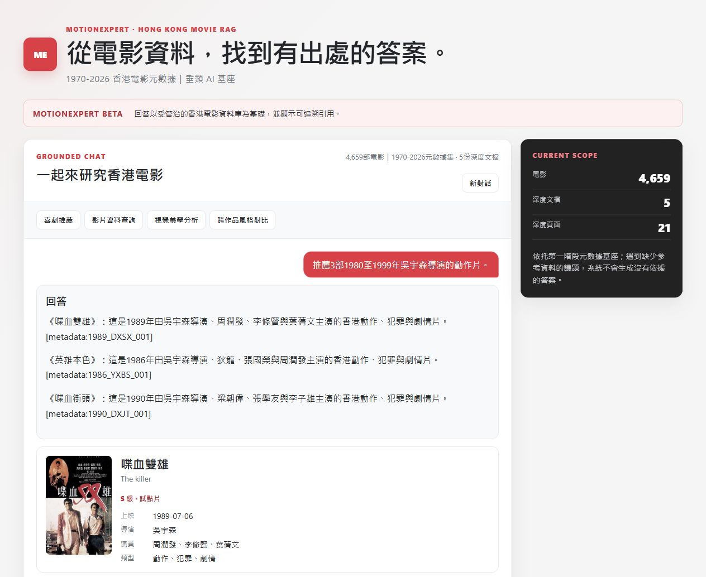

<div align="center">

# HK Movie RAG

**Evidence-grounded discovery for Hong Kong cinema.**

Ask in Chinese. Resolve the right film. Recommend within constraints. Inspect the evidence.

<a href="pyproject.toml"></a>
<a href="src/hk_movie_rag/rag_db.py"></a>
<a href="src/hk_movie_rag/vertex_clients.py"></a>
<a href="LICENSE"></a>

**[Try the chatbot](https://hk-movie-rag-demo-4l6lw3rnaa-uc.a.run.app)** · **[Getting started](docs/GETTING_STARTED.md)** · **[Evaluation](docs/EVALUATION.md)** · **[Read the report](report/COMP4136_HK_Movie_RAG_Report.pdf)**

</div>

HK Movie RAG turns a versioned **4,659-film catalog** into a conversational interface for factual lookup and constrained recommendations. It combines entity resolution, structured filtering, PostgreSQL/pgvector retrieval, and Vertex AI generation. Answers expose citations and canonical movie cards; ambiguous titles and unsupported facts lead to clarification or refusal.

<p align="center">
  <a href="https://hk-movie-rag-demo-4l6lw3rnaa-uc.a.run.app"></a>
</p>

<p align="center"><sub>Actual deployed interface: a constrained recommendation with metadata citations. Preview shows the answer and first movie card; this documentation example is separate from the evaluation run.</sub></p>

[Capabilities](#capabilities) · [Quick start](#quick-start) · [Architecture](#architecture) · [Evaluation](#evaluation) · [API](#api) · [Documentation](#documentation) · [Contributing](#contributing)

## Capabilities

| Capability | What the system does |
|---|---|
| **Precise film identity** | Resolves explicit IDs and title variants; asks for clarification when a title refers to multiple records. |
| **Chinese-language lookup** | Handles Traditional/Simplified variants while returning canonical catalog fields. |
| **Constraint-aware recommendations** | Applies director, cast, genre, tier, year-range, count, and exclusion requirements before answering. |
| **Conversational follow-ups** | Updates a decade or director, resolves references to earlier selections, and avoids requested repeats using actual history. |
| **Inspectable evidence** | Returns source citations and structured cards populated from canonical records. |
| **Evidence boundaries** | Withholds unsupported facts and handles out-of-domain questions without inventing an answer. |

The application also includes PDF passage retrieval and a same-origin poster proxy. The published comparison evaluates **metadata tasks**; it does not certify document reasoning or poster correctness.

## Quick start

### Explore the hosted demo

Open the **[live chatbot](https://hk-movie-rag-demo-4l6lw3rnaa-uc.a.run.app)**. No local setup is needed.

| Try this | Behavior to inspect |
|---|---|
| `《少林足球》的電影類型有哪些？` | Factual lookup with a metadata citation |
| `推薦3部1980至1999年吳宇森導演的動作片。` | Three unique films satisfying all conditions |
| `改成1990年代，其他條件不變。` | Follow-up that preserves relevant constraints |
| `《英雄本色》的導演是誰？` | Clarification between same-title films |
| `《重慶森林》在香港的總票房是多少？` | Refusal when the stored fields cannot support the requested fact |

### Install and verify the source

Use **Python 3.13**, **Git**, and **[uv](https://docs.astral.sh/uv/getting-started/installation/)**. The application follows the Python 3.13 runtime pinned in its Dockerfile.

```bash
git clone https://github.com/jimmy00415/COMP4136_Project.git
cd COMP4136_Project
uv sync --frozen --python 3.13

# Offline evaluation-tool tests: no cloud credentials or full catalog required.
uv run --frozen pytest -q course/test_simple_eval.py course/test_challenge_eval.py course/test_review_challenge.py course/test_query_fix_eval.py course/test_final_paired_eval.py
```

To serve the application locally, provide a populated PostgreSQL/pgvector database, a matching release, Google Cloud credentials, and the required process environment, then run:

```bash
uv run --frozen uvicorn hk_movie_rag.demo_api:app --host 127.0.0.1 --port 8080
```

Open `http://127.0.0.1:8080`. The source repository includes fixtures and migrations; the full catalog, documents, posters, database, and credentials are external. **[Getting started](docs/GETTING_STARTED.md)** explains runtime compatibility, configuration, test boundaries, and common setup errors.

## Architecture


1. **Interpret** the question and bounded history: identify the film, intent, and explicit constraints.
2. **Retrieve** release-bound evidence through structured catalog operations or compatible dense passage search.
3. **Answer** canonical facts directly or generate supported descriptions from selected evidence.
4. **Validate** citation identity and materialize canonical cards before returning the response.

Recommendation eligibility is checked before ranking and again before generation. Conversation updates operate on actual earlier questions, answers, and selected IDs. The implementation is application-level orchestration; it does not fine-tune model weights.

| Layer | Implementation |
|---|---|
| API and browser UI | [`demo_api.py`](src/hk_movie_rag/demo_api.py), [`static/`](src/hk_movie_rag/static/) |
| Answer routing and grounding | [`rag_query.py`](src/hk_movie_rag/rag_query.py) |
| Identity, constraints, and history | [`retrieval.py`](src/hk_movie_rag/retrieval.py) |
| PostgreSQL and pgvector | [`rag_db.py`](src/hk_movie_rag/rag_db.py), [migrations](src/hk_movie_rag/migrations/) |
| Managed-model clients | [`vertex_clients.py`](src/hk_movie_rag/vertex_clients.py) |

The evaluated release contains **4,659 metadata passages**, **21 passages from five PDFs**, and **4,680 768-dimensional embeddings**. Generation uses `gemini-3.5-flash-lite`; embeddings use `gemini-embedding-2`. Release, model, policy, revision, and container identities are retained in the [experiment freeze](course/final_paired_freeze.json).

## Evaluation

A fresh paired study ran on **5 October 2026**: **60 turns per method**, **120 retained responses**, alternating method order, and each method's own actual dialogue history. Both methods use the same catalog, questions, configured generator, and acceptance criteria.

| Task family | Deployed system | BM25 + LLM |
|---|---:|---:|
| Ambiguity / explicit ID | **10/10** | 10/10 |
| Traditional / Simplified Chinese | **10/10** | 10/10 |
| Compound recommendations | **10/10** | 7/10 |
| Evidence / domain boundary | **10/10** | 10/10 |
| Dialogue | **20/20** | 13/20 |
| **Total task completion** | **60/60 · 100%** | **50/60 · 83.3%** |

**Observed gain: 16.7 percentage points.** All ten gains concern completing recommendations: the BM25 top-eight context contains too few eligible films even when the catalog has enough. Both methods return catalog-consistent card fields (**784/784 vs. 680/680**) and appropriately clarify or refuse unsupported requests.

These are **known development cases with AI-reviewed outcomes**, not unseen-test accuracy. Seven baseline automatic false negatives were corrected transparently. The applications have different internal retry, rendering, and fallback policies. System median latency is lower (**0.763 vs. 1.349 s**), but its observed maximum is higher (**51.523 vs. 14.430 s**). Human review remains pending.

**[Protocol and reproducibility](docs/EVALUATION.md)** · **[Complete results](course/FINAL_COMPARISON_RESULTS.md)** · **[All 120 responses](course/final_paired_answers.jsonl)** · **[Per-case review](course/final_paired_review.json)**

## API

| Endpoint | Purpose |
|---|---|
| `GET /` | Browser chat interface |
| `GET /health` | Service health |
| `GET /api/config` | Nonsecret release, model, policy, and serving identities |
| `POST /api/chat` | Factual answers and recommendations |
| `GET /api/posters/{movie_id}` | Validated poster proxy |

Minimal Python request to the hosted demo:

```python
import json
from urllib.request import Request, urlopen

url = "https://hk-movie-rag-demo-4l6lw3rnaa-uc.a.run.app/api/chat"
payload = {"question": "《少林足球》的電影類型有哪些？", "history": []}
request = Request(
    url,
    data=json.dumps(payload, ensure_ascii=False).encode("utf-8"),
    headers={"Content-Type": "application/json"},
)
with urlopen(request, timeout=90) as response:
    result = json.load(response)
print(result["answer_markdown"])
```

The response contains `answer_markdown`, `citations`, and `movies`. To continue a conversation, send prior exchanges as `question`, `answer`, and `movie_ids`; the API accepts up to **four exchanges** and **12,000 history characters**. See the [API usage guide](docs/GETTING_STARTED.md#api-and-history) for a complete follow-up example.

## Documentation

| Guide | Start here when you want to… |
|---|---|
| [Getting started](docs/GETTING_STARTED.md) | Install, run offline tests, configure a backend, or use the API |
| [Evaluation](docs/EVALUATION.md) | Understand the comparator, scoring, limitations, and reproduction controls |
| [Engineering guide](docs/ENGINEERING_GUIDE.md) | Inspect data-build, ingestion, release, and deployment procedures |
| [Final report](report/COMP4136_HK_Movie_RAG_Report.pdf) | Read methodology, related work, experiments, and case studies |
| [Report source and build](report/FINAL_REPORT.md), [build guide](report/BUILD.md) | Edit or rebuild the report offline |
| [Contributing](CONTRIBUTING.md) | Report a reproducible issue or propose a focused change |

```text
src/hk_movie_rag/    API, retrieval, answering, model clients, policies, migrations, UI
course/             Evaluation tools, frozen questions, retained answers and reviews
config/             Data and deployment configuration
scripts/gcp/        Provisioning, deployment and smoke-check tools
tests/              Controlled unit fixtures and release integration tests
docs/               Setup, evaluation, engineering and source contracts
report/             Report source, PDF, figures and verification records
```

## Contributing

Bug reports, documentation fixes, and focused improvements are welcome. Use [GitHub Issues](https://github.com/jimmy00415/COMP4136_Project/issues) for reproducible problems and read [CONTRIBUTING.md](CONTRIBUTING.md) before opening a pull request. Include the query, expected behavior, observed behavior, and nonsecret runtime identity where relevant.

## License and project context

Source code is available under the **[MIT License](LICENSE)**. External metadata, posters, and PDFs have their own provenance and rights; the code license does not grant rights to those assets.

Developed as a native **COMP4136** project, not a previously submitted assignment. AI assistance in repairs, tests, evaluation, figures, and documentation is disclosed in the report. Student identity fields remain unfilled at the owner's request; course submission is a separate step. Source provenance and deployed-image identity are recorded in the [deployment summary](course/query_fix_summary.json).
