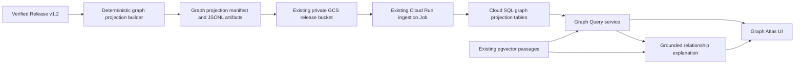

# Hong Kong Movie Knowledge Graph + RAG Graph Atlas Design

**Date:** 2026-08-10

**Status:** Approved section by section in conversation on 2026-08-10

## Decision summary

Build a release-governed Knowledge Graph projection on top of the existing Hong Kong Movie RAG
demo. Keep Cloud SQL PostgreSQL as the only database, retain pgvector for semantic evidence, and
make an interactive **Graph Atlas** the primary post-login experience. Chat remains available only
as the secondary `Ask about this relationship` action.

The approved first release has these fixed boundaries:

- graph entity/edge authority: only the existing verified Release v1.2; the two already governed
  RAG PDFs may support explanations but may never create graph entities or edges;
- graph nodes: movies, people, and genres;
- direct predicates: `DIRECTED_BY`, `WRITTEN_BY`, `ACTED_IN`, and `HAS_GENRE`;
- traversal: at most three edges, executed by parameterized server queries;
- database: PostgreSQL graph tables beside the existing RAG and pgvector tables;
- person identity: release-scoped exact-name clusters, not externally verified natural people;
- visual target: the selected Graph Atlas direction with the graph as the main canvas and a
  governed evidence inspector on the right;
- model boundary: Gemini may verbalize a server-selected path but may not create graph queries,
  select a different path, invent edges, or broaden recommendation candidates;
- deployment boundary: reuse the current private bucket, ingestion Job, Cloud Run service, session
  gate, poster proxy, Cloud SQL instance, and Vertex configuration.

Neo4j, external enrichment, public poster delivery, a React migration, generated person portraits,
and unrestricted graph or model queries are outside this design.

## Current baseline

The current `main` branch already implements a minimum verifiable RAG product slice:

- 4,658 authoritative movie rows;
- 4,658 metadata passages and embeddings;
- two governed PDF documents with six page passages;
- Cloud SQL PostgreSQL 16 with pgvector;
- structured tier, genre, year, and person-qualified recommendation retrieval;
- bounded browser-tab conversation context;
- grounded Vertex generation with server-validated citations;
- same-origin private poster delivery for 4,545 available posters and explicit unavailability for
  113 rows;
- one FastAPI-served HTML/CSS/JavaScript experience protected by the existing demo session.

The graph design extends these contracts. It does not replace the authoritative movie table,
re-embed the corpus, change the Phase 1 Release manifest, weaken poster governance, or claim
production readiness.

### Observed v1.2 graph baseline

A read-only design-time projection over `data/release/v1.2/movies.parquet`, using the current
release credit normalization functions and separator contract `[、,，/;；]`, produced:

| Measure | Expected first-projection value |
|---|---:|
| Movie entities | 4,658 |
| Person exact-name equivalence entities | 6,039 |
| Genre entities | 33 |
| Total entities | 10,730 |
| `DIRECTED_BY` edges | 5,185 |
| `WRITTEN_BY` edges | 6,969 |
| `ACTED_IN` edges | 13,740 |
| `HAS_GENRE` edges | 6,189 |
| Total direct edges | 32,083 |
| Source person-name spellings | 6,043 |
| Unique movie-title alias rows (`chinese_title` + non-empty `english_title`) | 8,526 |
| Genre alias rows | 33 |
| Total alias rows | 14,602 |
| Person equivalence keys with multiple source spellings | 4 |
| Simplified query aliases mapping to multiple equivalence keys | 3 |

Fourteen repeated screenwriter positions collapse into already-identical movie/predicate/person
edges. The projection must preserve their source occurrence positions while publishing only one
direct edge. These counts are acceptance fixtures for the current immutable input and normalization
policy. A mismatch blocks projection activation rather than silently changing the expected graph.

## Objective

Deliver a credible UI/UX demo in which a user can:

1. search for a governed movie, person name, or genre;
2. place that entity at the center of an explorable relationship graph;
3. expand one relationship layer at a time, up to three edges from the path origin;
4. select two governed entities and find their verified shortest paths within the same limit;
5. inspect authoritative movie fields, relationship provenance, poster state, and identity caveats;
6. discover related movies with explicit relationship reasons;
7. ask a natural-language question about the currently selected path and receive a grounded,
   cited answer when the evidence supports one.

The answer is not the only product surface. Direct graph exploration, movie discovery, and evidence
inspection must remain useful when Vertex generation is unavailable.

## Non-goals

The first release does not include:

- Wikidata, IMDb API, HKFA API, or any new external entity authority;
- external person IDs, manual person disambiguation tooling, or a claim that a name cluster is one
  real-world individual;
- production companies, locations, awards, events, or precomputed collaboration edges;
- Neo4j, Apache AGE, GraphQL, model-generated SQL, or model-generated Cypher;
- unrestricted path depth, arbitrary predicates, graph analytics, centrality, community detection,
  or link prediction;
- new embeddings for entities or edges;
- user accounts, saved collections, cross-device graph sessions, public poster URLs, or a CDN;
- a public launch, production SLO, on-call contract, or claim that the recommendation weights are
  empirically optimal.

## Product experience

### Primary journey

```text
Search movie/person/genre
        -> center one entity in Graph Atlas
        -> inspect its governed one-hop neighborhood
        -> expand one node at a time, up to three edges
        -> select a path or related movie
        -> inspect source evidence and poster state
        -> optionally ask about the selected relationship
```

The graph canvas is the primary surface. The right inspector shows the selected node, its direct
relationships, source details, identity status, and related-movie actions. A persistent bottom
breadcrumb shows the exact path, supports backtracking, and prevents users from losing the meaning
of a three-hop exploration.

`Ask about this relationship` opens a secondary explanation panel. It receives the already-selected
entity and edge IDs; it is not a blank, dominant chatbot composer and it cannot switch the graph to
a model-chosen path.

### Selected visual direction

The approved direction is Graph Atlas option 1:

- dark near-black base (`#0d1111`), ivory text (`#f6f0e5`), coral focus accents
  (`#ef5b3f` / `#ff795e`), and jade relationship accents (`#84b89b`);
- restrained archival grid and glass surfaces consistent with the existing app;
- Traditional Chinese serif display type for movie titles and a legible sans-serif for controls;
- top-level entity search, a dominant central graph, a right evidence inspector, and a bottom path
  breadcrumb;
- one clear primary action in the inspector and a quieter relationship-question action;
- no KPI dashboard, card inventory, fake logo, emoji, generated person photo, or unexplained
  similarity percentage.

The generated concept is a hierarchy and interaction reference, not a factual content source. It is
intentionally not a repository asset because it contains illustrative, non-governed person imagery.
This written layout/asset contract is the canonical implementation target, and every visible node
and relationship must come from graph API data.

## System architecture



The graph is an immutable, reproducible projection rather than a second source of truth. The first
projection ID is exactly `v1.2-kg1`; it binds to the active RAG release and the exact parent Release
manifest. It reuses the existing embeddings and does not create a new RAG release merely to add
relationships.

The graph artifacts use the exact create-only GCS prefix `graph/v1.2-kg1/`. They are loaded by the
existing ingestion Job into additive Cloud SQL tables. No new database or runtime service is
required.

## Projection authority and activation

### Authorized inputs

The builder reads exactly five inputs: `data/release/v1.2/release_manifest.json`, the
manifest-authorized `data/release/v1.2/movies.parquet` bytes, `config/rag_demo.yaml`,
`config/kg/normalization.v1.json`, and `config/kg/recommendation.v1.json`. The two KG policy files are
committed implementation artifacts whose canonical bytes are bound into the projection manifest;
the RAG config supplies the exact parent RAG release ID and parent-manifest binding. The builder does
not recursively discover files, consult a network source, or read the governed PDFs when creating
graph entities or edges.

The immutable projection bundle contains:

- `kg_entities.jsonl`;
- `kg_aliases.jsonl`;
- `kg_edges.jsonl`;
- `kg_projection_manifest.json`.

The manifest names and binds three distinct source digests:

- `release_manifest_file_sha256`: SHA-256 of the exact Release manifest file bytes, currently
  `e9842db33208e7146d78d86689b13f81fffcf41288d79d84e599b93050445e2c`;
- `upstream_source_manifest_sha256`: the provenance value embedded inside that Release manifest,
  currently `cbd529e126e8b72dccac302d9746fcfa63318caecbcda24548c05e282e13f974`;
- `movies_artifact_sha256`: the declared and independently recomputed digest of
  `movies.parquet`, currently
  `c3f7b30a6305dec7f2cabca1397974012fc8dcfba9ee96ec69fe385dfdd3a58f`.

The manifest also binds:

- projection schema version and projection ID;
- active RAG release ID;
- `rag_config_sha256`, computed from the exact `config/rag_demo.yaml` bytes;
- `rag_movie_set_sha256`, computed from the active RAG release's sorted
  `(movie_id, payload_sha256)` pairs using the canonical encoding below. At build time these pairs
  are derived from the authorized Parquet rows using the existing canonical RAG movie-payload
  serializer; activation recomputes them from the bound database release;
- normalization/recommendation policy SHA-256 values;
- path, byte length, row count, and SHA-256 for each of the three JSONL artifacts;
- expected counts by entity type and predicate;
- one aggregate projection digest.

`kg_projection_manifest.json` is not an entry in its own `artifacts` array and is not part of the
projection digest input. Its file SHA-256 is recorded by the create-only upload/ingestion receipt
after the manifest bytes exist, avoiding a self-hash.

Repeated builds from identical inputs must produce byte-identical artifacts and manifest bytes.

### Activation

Loading is idempotent and conflict-intolerant. Existing rows may be skipped only when every stored
field and digest matches the input. During a first load, a conflicting identity rolls back the load
transaction; a separate transaction changes that non-active projection from `loading` to `failed`
and the existing `ingestion_runs` row records the redacted failure. If a caller reuses an
already-active projection ID with any conflicting input field or digest, the replay rolls back and
its ingestion run fails, but the previously active projection row and content remain unchanged.

A projection becomes `active` only after one transaction proves:

- parent RAG release is active;
- all three named Release digests, `rag_config_sha256`, and both policy digests match the manifest;
- the active RAG movie-set digest matches `rag_movie_set_sha256`;
- all entity, alias, edge, and per-predicate counts match;
- all edge endpoints exist in the same projection;
- all source movie IDs belong to the parent release;
- every movie entity payload hash, person/genre entity evidence-set digest, alias evidence-set
  digest, and edge source digest recomputes from the authoritative movie payloads;
- no path-affecting duplicate or orphan row exists.

When `RAG_GRAPH_ENABLED=true`, the image must contain the exact projection manifest and runtime
startup additionally requires a non-secret `RAG_GRAPH_PROJECTION_SHA256` value. The server reads the
projection ID and digest from the packaged manifest, requires the environment digest to match, and
then selects exactly the database row with that ID, digest, active parent RAG release, and
`status=active`. It never auto-selects the newest projection. Authenticated `/api/config` must expose
`graph_enabled=true`, this digest, and the projection ID for verification. A missing or mismatched
binding prevents graph route readiness without changing the older RAG data. When the flag is false,
graph-specific configuration is optional, graph routes return `404`, `/api/config` reports
`graph_enabled=false`, and the existing chat UI/API behavior remains unchanged.

## PostgreSQL data model

### `kg_projections`

One row per immutable projection:

- `projection_id` primary key;
- `rag_release_id` foreign key to `rag_releases`;
- a unique `(projection_id, rag_release_id)` pair for child-table release binding;
- schema, source manifest, normalization policy, recommendation policy, and a unique projection
  digest;
- expected and actual counts;
- `status` in `loading`, `active`, or `failed`;
- creation and activation timestamps.

Updates may change only loading-state counters and one terminal transition from `loading` to
`active` or `failed`. Active and failed projection identity/content is immutable; delete is
prohibited. A failed projection is not retried under the same ID—corrected content requires a new
projection ID and create-only prefix.

### `kg_entities`

One row per release-scoped entity:

- `(projection_id, entity_id)` primary key;
- `entity_type` in `movie`, `person`, or `genre`;
- canonical label and canonical key;
- `identity_status`, required as `authoritative` for movies/genres or `name_only` for people;
- authoritative movie payload SHA-256 where applicable, an `evidence_set_sha256` where applicable,
  and a small validated JSON payload. Movie rows require `movie_payload_sha256` and store
  `evidence_set_sha256=NULL`; person and genre rows require `evidence_set_sha256` and store
  `movie_payload_sha256=NULL`.

ID rules:

- movie: `movie:<movie_id>`;
- person: `person-name:<domain-separated SHA-256 suffix defined in the canonical encoding section>`;
- genre: `genre:<percent-encoded canonical token>`.

Entity IDs are deterministic. Model output is never executed as a graph query; every caller-supplied
ID, regardless of where it was copied from, is grammar-checked and reloaded from the bound active
projection before use.

### `kg_aliases`

One row per unique `(entity_id, source_label)` pair:

- `(projection_id, alias_id)` primary key;
- projection and entity IDs;
- source label;
- normalized exact key;
- derived, non-authoritative simplified query key;
- sorted `source_fields` (`chinese_title`, `english_title`, credit role, or `genre`),
  `occurrence_count`, canonical `source_occurrences`, and `evidence_set_sha256` over those occurrence
  records.

Only labels present in Release v1.2 are stored as display aliases. Movie aliases include every
Chinese title and every non-empty English title. Genre aliases include the 33 exact Release tokens.
Person aliases include the 6,043 unique source spellings across all governed credit roles.
Simplified forms are derived query keys under the project's existing OpenCC contract, not new source
facts and not reversible transformations. If a query key maps to more than one entity, search returns
candidates and never auto-selects one. Sixteen movies have the same non-empty label in both title
fields; those field occurrences aggregate into one alias row. The current v1.2 projection therefore
expects 14,602 alias rows, not one duplicate row per source field or movie occurrence.

### `kg_edges`

One row per unique direct relationship:

- `(projection_id, edge_id)` primary key;
- `rag_release_id`, constrained to equal the owning projection's release;
- subject and object entity IDs;
- predicate enum;
- authoritative source movie ID and source field;
- `source_value_sha256`;
- sorted `source_token_positions` and `occurrence_count`;
- deterministic `edge_payload_sha256`.

Direct edge directions are:

- `movie --DIRECTED_BY--> person` from `director`;
- `movie --WRITTEN_BY--> person` from `screenwriter`;
- `person --ACTED_IN--> movie` from `cast`;
- `movie --HAS_GENRE--> genre` from `genre`.

Reverse traversal is a query operation, not a separately stored edge. Collaboration, co-starring,
and relatedness are computed paths and are never persisted as inferred facts.

### Required constraints and indexes

Aliases and both edge endpoints have same-projection foreign keys to `kg_entities`. Each edge has
`FOREIGN KEY (projection_id, rag_release_id)` to the unique projection/release pair and
`FOREIGN KEY (rag_release_id, source_movie_id)` to `movies(release_id, movie_id)`. Check constraints
enforce the entity-type/identity-status pairing, predicate direction, non-empty occurrence sets, and
exact count agreement. In addition to the primary keys and unique projection digest, required
indexes are:

- aliases on `(projection_id, normalized_exact_key, entity_id)` and
  `(projection_id, simplified_query_key, entity_id)`;
- forward edges on
  `(projection_id, subject_entity_id, predicate, object_entity_id, edge_id)`;
- reverse edges on
  `(projection_id, object_entity_id, predicate, subject_entity_id, edge_id)`.

Contained-label search may scan the 14,602-row bound alias projection; it does not justify a new
extension in this release. Query plans for all six graph routes are captured in focused tests and
must remain inside the online response/timeout budgets.

## Entity normalization and identity semantics

Credit and genre fields split only on the committed separator contract. Tokens are trimmed, empty
values are dropped, and malformed token lengths fail validation according to the policy. Movies
reuse their authoritative IDs. Genre entities use exact release tokens.

Person entities represent a **Release exact-name equivalence cluster**. Traditional variants that
the existing committed equivalence converter maps to the same key share one entity. A person may
hold multiple roles because role is expressed by edges.

This supports release-scoped questions such as "Which films carry the credit name 成龍?" and graph
paths across those films. It does not prove that every identical credit spelling is one real person.
Every person entity therefore carries `identity_status=name_only`, and the inspector states:

> Matched by exact governed credit name within this Release; same-name people may be combined.

This caveat is visible in the evidence inspector and relationship explanation metadata. External
disambiguation is a future, separately governed enrichment layer.

## Canonical encoding, labels, and deterministic IDs

All graph text is decoded as strict UTF-8, normalized to Unicode NFC, and trimmed of leading and
trailing Unicode whitespace. Internal whitespace runs become one ASCII space for query keys but are
preserved in source labels. The builder does not apply NFKC or punctuation deletion to source facts.

`normalize_query_key(value)` applies that NFC/trim/whitespace rule and then Unicode default
case-folding. Each alias's `normalized_exact_key` is `normalize_query_key(source_label)`. Its derived
simplified key is `normalize_query_key(OpenCC_hk2s(source_label))`, using the exact OpenCC
configuration/version bound by the normalization policy. Neither query key becomes a display fact.

Canonical display labels are deterministic:

- movie: exact `chinese_title`; `english_title` is a secondary alias/subtitle when non-empty;
- genre: exact normalized Release token;
- person: prefer a source spelling that exactly equals the traditional equivalence key, then choose
  the lexicographically smallest UTF-8 byte sequence; if none equals the key, choose the smallest
  source spelling by the same byte ordering.

`sha256_hex(domain, payload)` means SHA-256 over the UTF-8 domain string, one NUL byte, and the
payload bytes. IDs use these exact domains:

- person entity suffix: `sha256_hex("hk-movie-kg/person-id/v1", equivalence_key_utf8)`;
- alias ID: `sha256_hex("hk-movie-kg/alias-id/v1", canonical_alias_identity_json)`;
- edge ID: `sha256_hex("hk-movie-kg/edge-id/v1", canonical_edge_identity_json)`.

The alias identity is the canonical JSON array `[projection_id, entity_id, source_label]`. The edge
identity is
`[projection_id, rag_release_id, subject_entity_id, predicate, object_entity_id, source_movie_id,
source_field]`.
Occurrence positions do not alter edge identity. Genre entity suffixes use RFC 3986 percent-encoding
of normalized UTF-8 bytes, retain only unreserved ASCII characters, and use uppercase hexadecimal.

Token occurrence positions are zero-based indexes into the original regular-expression split
segments before empty trimmed segments are discarded. Duplicate equivalent tokens for one
movie/predicate/entity produce one edge with sorted unique positions and the exact occurrence count.

A canonical occurrence record has exactly these fields:

```text
{
  "source_movie_id": <movie_id>,
  "source_field": <chinese_title|english_title|director|screenwriter|cast|genre>,
  "source_position": <zero-based integer>,
  "source_label": <NFC-normalized and trimmed title/token>,
  "source_value_sha256": <domain-separated digest of the complete source field value>
}
```

Title fields use position `0`; split credit and genre fields use the token position defined above.
`source_value_sha256` is `sha256_hex("hk-movie-kg/source-value/v1",
source_field_value_utf8)`, where the payload is the exact strict-decoded Parquet string encoded back
to UTF-8 with no trimming, NFC conversion, or separator changes. Occurrence records sort by
`(source_movie_id, source_field, source_position, source_label_utf8, source_value_sha256)`. A
person/genre entity evidence set contains all of its records; an alias evidence set contains only
records for that `(entity_id, source_label)` pair. Movie entities use their already-authoritative
payload digest instead of an evidence set.

Canonical JSON uses UTF-8 without BOM, Unicode characters unescaped, keys sorted by Unicode code
point, separators `,` and `:` without added spaces, and rejects NaN/infinity. JSONL uses one canonical
object plus `\n` per record, including the final record. Sort orders are:

- entities: `(entity_type, entity_id)`;
- aliases: `(entity_id, source_label_utf8, alias_id)`;
- edges: `(subject_entity_id, predicate, object_entity_id, source_movie_id, source_field, edge_id)`.

An evidence-set digest is `sha256_hex("hk-movie-kg/evidence-set/v1", canonical_json(records))`
over those sorted canonical occurrence records. An edge's `edge_payload_sha256` is
`sha256_hex("hk-movie-kg/edge-payload/v1", canonical_json(payload))`, where `payload` is the exact
array `[edge_id, rag_release_id, subject_entity_id, predicate, object_entity_id, source_movie_id,
source_field, source_value_sha256, sorted_unique_source_positions, occurrence_count]`.
`rag_movie_set_sha256` uses the domain
`hk-movie-kg/rag-movie-set/v1` and canonical JSON over sorted `[movie_id, payload_sha256]` pairs.

The projection digest is `sha256_hex("hk-movie-kg/projection/v1",
canonical_json(projection_digest_input))`. `projection_digest_input` is exactly:

```text
{
  "schema_version": "1.0",
  "projection_id": <projection ID>,
  "rag_release_id": <RAG release ID>,
  "release_manifest_file_sha256": <hex digest>,
  "upstream_source_manifest_sha256": <hex digest>,
  "movies_artifact_sha256": <hex digest>,
  "rag_config_sha256": <hex digest>,
  "rag_movie_set_sha256": <hex digest>,
  "normalization_policy_sha256": <hex digest>,
  "recommendation_policy_sha256": <hex digest>,
  "expected_counts": {
    "entities": {"movie": 4658, "person": 6039, "genre": 33, "total": 10730},
    "aliases": {"movie": 8526, "person": 6043, "genre": 33, "total": 14602},
    "edges": {
      "DIRECTED_BY": 5185,
      "WRITTEN_BY": 6969,
      "ACTED_IN": 13740,
      "HAS_GENRE": 6189,
      "total": 32083
    }
  },
  "artifacts": [
    {"path": "kg_aliases.jsonl", "size_bytes": <integer>, "row_count": 14602, "sha256": <hex digest>},
    {"path": "kg_edges.jsonl", "size_bytes": <integer>, "row_count": 32083, "sha256": <hex digest>},
    {"path": "kg_entities.jsonl", "size_bytes": <integer>, "row_count": 10730, "sha256": <hex digest>}
  ]
}
```

The `artifacts` array contains exactly the entity, alias, and edge JSONL files sorted by UTF-8 path.
It excludes the manifest, timestamps, `projection_digest`, and upload receipt. These algorithms, not
filesystem timestamps, insertion order, locale, or Python object iteration, determine byte identity.
`kg_projection_manifest.json` is the same top-level object plus only the computed
`projection_digest`, serialized as canonical JSON with a final newline. Host paths, build times, and
upload metadata exist only in the external receipt.

## Query service

All graph routes require the existing authenticated demo session and same-origin request contract.
Every successful graph response contains `projection_id`, `projection_digest`, and `rag_release_id`.
Graph errors use the existing safe error envelope plus a request ID; they include projection metadata
only after that binding has been validated. A disabled-route `404` therefore exposes no projection
metadata.

### `GET /api/graph/search`

Accepts `q` from 1 through 128 Unicode characters, an optional subset of the three entity types,
`limit` from 1 through 20, and an optional opaque cursor no longer than 1,024 ASCII characters. Movie
search covers both governed Chinese and non-empty English titles; the Chinese title remains the
display label. Genre search covers exact Release tokens and their derived simplified query keys.
Person search covers governed source spellings and their derived query keys.

Ranking is exact source label, then unique derived query key, then prefix, then contained label,
followed by entity type, canonical label UTF-8 bytes, and entity ID. There is no fuzzy
auto-resolution. Duplicate movie titles and query-key collisions return separate candidates.
Responses include `has_more` and `next_cursor` when continuation exists; a 20-row page never implies
that additional matches do not exist.

### `GET /api/graph/entities/{entity_id}`

Returns one entity's validated public payload, identity status, source summary, and available poster
path for movie entities. It accepts a canonical entity ID of at most 256 ASCII characters matching
the type-specific ID grammar and never a GCS object path.

### `POST /api/graph/neighborhood`

Accepts `origin_entity_id`, `expanded_entity_id`, a selected path containing one through three entity
IDs and zero through two edge IDs, a subset of the four predicates, `page_size` from 1 through 30,
and an optional opaque cursor no longer than 1,024 ASCII characters. It expands exactly one edge
layer per request. The server reloads the path, verifies that it is simple and continuous, requires
the origin and expanded entity to be its first and final entities, and caps every returned node at
three edges from the origin. A node already three edges from the origin remains inspectable but its
expand action is disabled and rejected server-side.

The pagination unit is one adjacent-entity group. The server groups every qualifying direct edge
between the expanded entity and one adjacent entity, orders that group's edges by `(predicate,
edge_id)`, and never splits a group across pages. Adjacent movie groups sort by release date
descending with nulls last, then movie ID ascending. Person groups sort next by canonical-label UTF-8
bytes and entity ID; genre groups follow with the same label/ID ordering. The cursor stores the last
complete group key.

One page returns at most 30 adjacent-entity groups and 120 direct edges. Each group includes the
validated adjacent-node payload and all qualifying parallel edges. The server does not omit a group
merely because its entity may already be present in client state; the UI de-duplicates nodes by
entity ID while retaining every returned edge. Larger result sets return `has_more=true` and
`next_cursor`; the API never silently drops a relationship while implying completeness.

### `POST /api/graph/paths`

Accepts two canonical entity IDs, `max_depth` from one through three, and `max_paths` from one
through 20. It returns deterministic shortest simple paths ordered by edge count and canonical
edge-ID sequence. If more paths exist, the response marks the result incomplete rather than
implying exhaustive coverage. The server resolves every ID against the active projection and never
accepts free-form predicates or caller-supplied relationship content.

### `POST /api/graph/recommendations`

Requires one movie entity as `anchor_entity_id`, an optional verified path that begins at that movie,
up to eight required person/genre entity IDs, optional inclusive release-year bounds, an optional
subset of governed data tiers, preference text from zero through 500 Unicode characters, a requested
count from one through eight, and at most 32 excluded movie IDs. It always excludes the anchor and
every movie already present in the selected path/exclusion set. Path nodes become recommendation
constraints only when the caller explicitly includes their person/genre IDs in the required set. It
returns only graph-qualified movies, deterministic relationship reasons, citations, and poster
state.

Person and genre entities do not use this score. Their inspector calls the
`POST /api/graph/neighborhood` endpoint with that entity as the path terminal and only predicates
that connect it to movies. This inspector query uses an independent one-entity origin/path and does
not replace the canvas breadcrumb. It renders the returned adjacent-movie groups, exact relationship
labels, and the same cursor; no separate hidden query contract is used. A multi-entity path may
constrain a movie-anchor recommendation but is not itself a scoring anchor.

### `POST /api/graph/explain`

Accepts a question from 1 through 1,000 Unicode characters, two through four path entity IDs, and one
through three path edge IDs already selected by the UI. The server reloads and validates the
complete path from the active projection. The caller cannot supply edge bodies, SQL, predicates,
source text, citation IDs, or conversation history. Relationship explanations are single-turn in
this release; the existing `/api/chat` route retains its separate bounded browser-tab context.

### Query safety

All POST routes require JSON and the existing same-origin/session checks. Traversal uses fixed,
parameterized SQL and a recursive CTE with a visited-entity array. Each online graph-query
transaction applies a 2,000 ms local PostgreSQL statement timeout, predicate allowlists, the
three-edge limit, response budgets, and stable ordering. The ingestion/activation transaction uses a
separate 10-minute local statement timeout; exceeding it rolls back the load and records a failed
ingestion run. SQL-like user text is ordinary data and requires no brittle keyword filter; it can
never alter the parameterized statement.

Cursors are base64url-encoded, HMAC-authenticated payloads bound to the projection digest, endpoint,
query fingerprint, relation filters, page size, last stable sort key, and an expiry no more than ten
minutes after issue. Invalid, expired, cross-query, or cross-projection cursors return `422`. The
server does not claim to detect whether a valid entity ID was typed by a person or copied from a
model; safety comes from active-projection lookup and server-side path reconstruction.

## Recommendation policy

Default related-movie ranking is transparent and versioned:

```text
graph_score =
    5 * has_shared_director
  + 4 * has_shared_screenwriter
  + 2 * min(shared_cast_count, 3)
  + 1 * min(shared_genre_count, 2)
```

Each component is same-role: both movies must connect to the person through `DIRECTED_BY`, both
through `WRITTEN_BY`, or both through `ACTED_IN`; genres must match through `HAS_GENRE`. A person who
appears in different roles across two movies remains a valid graph path but contributes no
recommendation score.

The policy is stored in committed canonical JSON and bound by SHA-256. It is a product heuristic,
not a claim of learned or optimal quality.

Score-contributing reasons are also deterministic. For each component, shared entities sort by
canonical-label UTF-8 bytes and entity ID. The server selects the first shared director, first shared
screenwriter, first three shared cast entities, and first two shared genres—the exact entities that
can contribute under the caps. Each reason carries that shared entity plus the exact anchor-edge and
candidate-edge IDs. Director, screenwriter, cast, and genre reasons appear in that component order;
extra shared entities are reported only as a per-component `additional_shared_count` and do not alter
the score or citation set.

Candidates must have `graph_score > 0`, meaning at least one score-bearing same-role person or genre
relationship with the movie anchor. Cross-role-only person connections remain explorable but are not
recommendation candidates. Candidates must also connect directly to every required person/genre
entity and satisfy the requested year and tier bounds. Merely traversing a path node does not
silently create a filter. The anchor and selected/excluded movies are never candidates. When the user
adds semantic preference text, one query embedding may tie-break only within equal graph-score groups
using each movie's single metadata-passage distance. PDF passages are not aggregated into
recommendation distance. Vector retrieval may not introduce a movie lacking the required graph
relationship.

The final order is graph score descending, optional valid cosine distance ascending, and movie ID
ascending. Recommendation reasons are built by the server from the exact winning edges; the model
does not author the title, relationship identity, citation marker, or card order.

## Graph evidence and RAG

The evidence model becomes a discriminated union:

- `graph_edge`: immutable edge ID, predicate, endpoint labels, source movie/field, and source digest;
- `movie_metadata`: existing metadata passage;
- `pdf_page`: existing governed page passage.

Graph citation IDs use `graph:<edge_id>`. Metadata and PDF citations retain their existing stable
passage IDs and source semantics.

For relationship explanation:

1. the server validates and reloads the selected path;
2. each path edge becomes mandatory graph evidence;
3. relevant metadata and PDF passages may be retrieved within the existing passage budget;
4. Gemini receives only the current question plus bounded, validated `supplied_evidence` records:
   reloaded graph facts and any retrieved metadata/PDF passage content, each paired with its immutable
   evidence ID;
5. the response must cite only supplied IDs;
6. the required graph citation sequence is exactly `graph:<edge_id>` in selected path order; each
   required graph ID must appear exactly once in the generated text and its relative order must be
   preserved;
7. optional supplied metadata/PDF IDs may be interleaved without affecting that graph subsequence,
   but every returned citation ID must still belong to the supplied evidence set;
8. a missing or reordered required graph ID, or any foreign/invented ID, rejects the whole generated
   answer.

Graph browsing, entity inspection, paths, and default recommendation reasons do not call Vertex.
Unsupported aesthetic, narrative, or historical claims still require deep documents. Metadata or
graph connectivity never becomes permission to invent qualitative analysis.

## Graph Atlas frontend

### Technology

Keep the current same-origin FastAPI-served frontend and split the growing JavaScript into focused
ES modules for API access, graph state, canvas rendering, inspector behavior, and explanation UI.
Do not introduce React for this release.

Use Cytoscape.js `3.34.0` (MIT), verified from the official npm package record on 2026-08-10, for
graph layout, selection, and viewport interaction. Pin the exact package in the lockfile, bundle it
locally, retain its license notice, and record the deployed asset SHA-256. The browser must never
fetch it from a CDN at runtime.

### Desktop layout

- header: product identity, entity search, release/projection status, and logout;
- left controls: node legend, predicate filters, fit/reset, and zoom controls;
- center: Graph Atlas canvas with the selected node emphasized;
- right inspector: selected entity details, identity caveat, source evidence, relationship groups,
  poster, related movies, and the secondary explanation action;
- bottom: current path breadcrumb with back, clear, and path-length state.

Single click inspects a node without changing the breadcrumb. A `Follow relationship` action on one
exact visible edge appends that edge and its adjacent node to the breadcrumb; when parallel edges
exist, the user chooses the predicate/edge explicitly. No implicit path wins when an already-loaded
node is reachable through multiple routes. The separate expand control is enabled only for the
breadcrumb terminal, so the API always receives the exact committed path. Backtracking removes only
nodes introduced beyond the retained step when they are no longer referenced.

### Asset governance

Movie posters remain private and use only the existing same-origin proxy after the authenticated
movie entity is resolved. The 113 unavailable rows show the existing explicit text placeholder and
make no image request.

Release v1.2 contains no governed person photos. Person nodes use names, initials, and node shape;
they never use generated faces, web-scraped portraits, or a movie poster crop as a person image.
The first release uses text-labeled controls and Cytoscape's built-in node shapes; it adds no icon
dependency, emoji, handcrafted SVG, or approximate decorative asset.

### Responsive behavior

- desktop at 1,024 CSS pixels and above: graph and inspector are visible side by side;
- tablet from 768 through 1,023 pixels: graph occupies the viewport and the inspector opens as a
  dismissible bottom sheet;
- mobile below 768 pixels: default to an equivalent list-first relationship explorer with the same
  entities, edges, path, evidence, and actions rather than compressing the dense canvas.

### Accessibility

Node type is encoded with text and shape in addition to color. The canvas has an equivalent semantic
relationship list for keyboard and screen-reader use. Focus moves to the newly added relationship
group after expansion. Search, selection, path backtracking, pagination, inspector actions, and
explanation remain fully keyboard operable. Reduced-motion preference disables animated layout
transitions.

## Failure behavior

- inactive projection, digest mismatch, count mismatch, or source-binding failure: graph routes
  return controlled `503`; the UI says the graph is not verified and does not render stale data;
- ambiguous alias: return candidates and require explicit selection;
- no path within three edges: report that no relationship was found in this Release, without asking
  the model to bridge the gap;
- search/neighborhood page-size budget reached: return the complete bounded page plus `has_more` and
  `next_cursor`; shortest-path `max_paths` truncation returns `incomplete=true`;
- recursive timeout: return a controlled retryable graph error; never fall back to generated facts;
- missing edge endpoint, foreign release row, or malformed graph response: fail the request;
- unavailable poster: show the governed placeholder without making a GCS request;
- poster integrity failure: retain the graph and return no poster;
- Vertex failure or invalid citation: retain the graph/path and show a controlled explanation error;
  do not erase the user's exploration or return partial generated prose;
- deep-analysis evidence unavailable: state that only structured relationship evidence is present.

## Verification and acceptance

### Projection gates

- repeat builds over current v1.2 inputs produce identical artifact bytes and projection digest;
- expected counts are exactly 10,730 entities and 32,083 unique direct edges, with the per-type and
  per-predicate counts listed above;
- expected aliases are exactly 14,602 unique `(entity_id, source_label)` rows, including 8,526 movie
  title aliases, 6,043 person source spellings, and 33 genre aliases;
- the 14 repeated screenwriter occurrences bind to their deduplicated edges without information
  loss;
- all 3 simplified alias collisions return explicit candidate sets;
- every edge endpoint, source movie, source field, source digest, and occurrence is valid;
- every edge release ID matches its projection and satisfies the composite source-movie foreign key;
- the projection digest recomputes from the exact three-artifact input object, while the manifest
  file hash is recorded only in the upload/ingestion receipt;
- a conflicting rerun cannot mutate an active row;
- activation is atomic and a failed load leaves no queryable partial projection.

### API gates

- search exact, simplified unique alias, prefix, ambiguity, no-result, and cursor-continuation cases;
- movie, person, and genre detail validation;
- one-hop expansion, adjacent-entity pagination, parallel-edge grouping, client de-duplication,
  inspector reuse, path backtracking, two-entity shortest-path search, cycle prevention, and the
  three-edge limit;
- deterministic recommendation score, capped contributor selection, paired anchor/candidate edge
  reasons, cross-role-only exclusion, optional vector tie-break, and stable order;
- cross-projection, malformed ID, disallowed predicate, and oversized request rejection, plus safe
  treatment of SQL-like search or preference text as inert parameter data;
- graph browsing and default graph-only recommendation instrumentation proves zero embedding and
  zero Gemini calls; an explicit semantic-preference recommendation may call the query embedder
  once but still makes no Gemini call;
- single-turn explanation reloads the path server-side, preserves the required graph-citation
  subsequence around optional citations, supplies validated graph/passage bodies with their IDs, and
  rejects foreign, missing, reordered, and fabricated citations;
- all graph routes reject unauthenticated requests and keep raw GCS paths private.

### Product scenarios

1. Searching `醉拳` centers the authoritative movie and exposes governed director, writer, cast,
   genre, source, and poster state.
2. Expanding `袁和平` shows Release films carrying that exact credit name and preserves the
   `identity_status=name_only` caveat.
3. A user can traverse `movie -> person -> movie -> genre`, see exactly three edges in the
   breadcrumb, and cannot expand to a fourth edge. Clicking an alternate loaded node inspects it but
   cannot silently replace that path; following one exact relationship commits the new breadcrumb.
4. A related-movie result names its actual shared director, writer, cast, or genre relationships;
   it never shows an unexplained score.
5. A simplified alias collision asks the user to select a candidate and never broadens the graph.
6. `Ask about this relationship` cites every selected graph edge and any supporting metadata/PDF
   passage; an unsupported qualitative question remains explicitly unsupported.
7. Available posters load only through the authenticated proxy; unavailable posters have no URL.
8. Desktop Graph Atlas, tablet inspector sheet, mobile list explorer, keyboard flow, focus behavior,
   and reduced motion all pass visual and interaction checks.
9. With `RAG_GRAPH_ENABLED=false`, graph routes return `404` and the existing chat home and
   `/api/chat` behavior are unchanged. With the flag enabled and the bound projection active, Graph
   Atlas becomes the post-login home while the existing `/api/chat` contract remains available.
10. Existing citation, poster, relevance, and live-smoke contracts remain green.

### Verification ladder

Use fresh evidence in this order during implementation:

1. focused graph projection, migration, repository, API, and frontend tests;
2. `uv run ruff check .`;
3. `uv run mypy src/hk_movie_rag`;
4. `uv run pytest -q`;
5. the existing Node static UI contract plus new Graph Atlas interaction contracts;
6. deterministic bundle/projection verification;
7. local authenticated end-to-end browser verification at desktop, tablet, and mobile viewports;
8. a separately authorized Cloud Run deployment and fresh full-flow live smoke.

Local green tests do not prove cloud deployment or production readiness.

## Rollout and rollback

Implementation proceeds in five reversible gates:

1. add graph schemas, deterministic builder, manifests, and offline verification without touching
   active runtime data;
2. add additive Cloud SQL migrations and idempotent loader, then validate a non-active projection;
3. add graph repository/API routes behind `RAG_GRAPH_ENABLED=false` by default;
4. add Graph Atlas UI and enable it only in a local/test configuration bound to the expected
   projection digest;
5. after all local gates pass, separately review cloud cost and authority, upload the create-only
   projection, run ingestion, deploy one candidate revision, and execute the full live smoke before
   making Graph Atlas the post-login home.

Rollback restores the prior Cloud Run revision or disables `RAG_GRAPH_ENABLED`. Additive graph
tables and immutable projection artifacts remain for diagnosis. The existing movies, embeddings,
facets, documents, posters, chat routes, and source archive are not deleted or rewritten.

## Implementation decomposition

The approved design is one cohesive feature but must be executed as isolated, reviewable slices:

1. graph policy, schemas, projection artifacts, and deterministic count verification;
2. PostgreSQL migration, loader, immutability, and graph repository;
3. authenticated graph APIs, traversal budgets, recommendation policy, and graph citations;
4. Graph Atlas UI, inspector, list fallback, accessibility, and asset governance;
5. explanation integration, end-to-end verification, deployment scripts, and live smoke.

Each slice must leave existing RAG behavior green and must not silently widen the authority of the
next slice.
