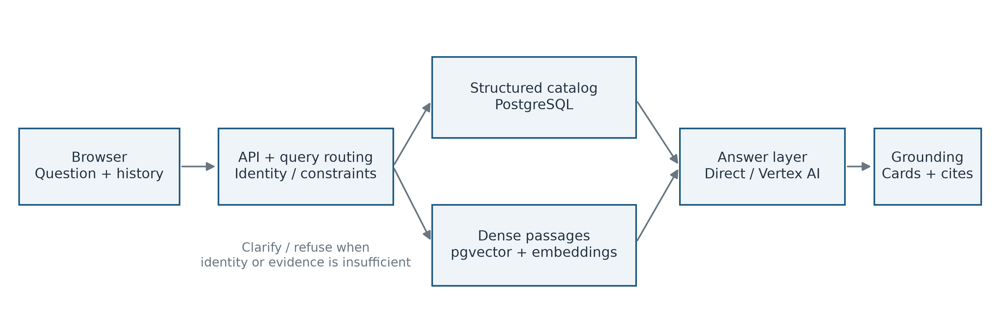
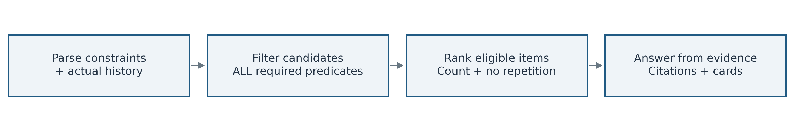
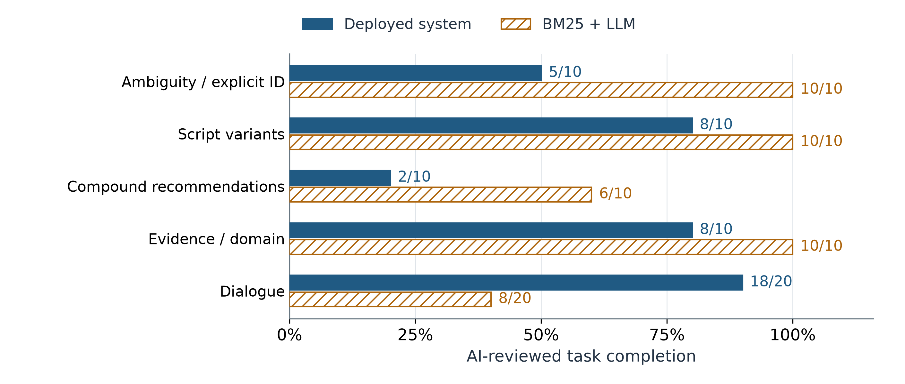

# Hong Kong Movie RAG

## Evidence-Grounded Chinese Question Answering and Conversational Recommendations

**COMP4136 Mini-Project | Final Report | 5 October 2026**

| Submission information | Details |
|---|---|
| Author name | ______________________________ |
| Student ID | ______________________________ |
| Group number | ______________________________ |
| Topic | Question answering / vertical-domain LLM application |

**GitHub repository:** [https://github.com/jimmy00415/COMP4136_Project](https://github.com/jimmy00415/COMP4136_Project)

**Live chatbot:** [https://hk-movie-course-frontend-4l6lw3rnaa-uc.a.run.app](https://hk-movie-course-frontend-4l6lw3rnaa-uc.a.run.app)

### Abstract

Answering questions about Hong Kong cinema requires more than plausible language generation. Titles can refer to multiple films, users mix Traditional and Simplified Chinese, recommendations combine several conditions, and follow-up requests depend on earlier selections. A useful assistant must also recognize when its evidence cannot support an answer. This project implements a deployed retrieval-augmented generation (RAG) system that combines a versioned catalog, structured constraint handling, PostgreSQL/pgvector retrieval, Vertex AI generation, and citation validation. Canonical metadata questions use direct evidence rendering; supported descriptive requests use selected evidence and a generator. Unsupported questions receive clarification or refusal.

The evaluated release contains 4,659 film records. A fresh paired study applies the same 60 known development turns to the deployed system and a BM25 + LLM baseline using the same catalog and configured generation model. All 120 responses are retained. Complete AI-assisted review accepted 60/60 system turns and 50/60 baseline turns, a descriptive difference of 16.7 percentage points. Both methods completed ambiguity, script-variant, and boundary tasks. The system completed more compound recommendations and dialogue turns. All 784 system and 680 baseline audited movie-card fields agreed with the catalog.

The result supports more complete constraint-aware task delivery on this selected set, rather than proving universal superiority or unseen-test accuracy. Both methods can clarify and refuse responsibly. System median latency was lower (0.763 vs. 1.349 seconds), but its observed maximum was higher (51.523 vs. 14.430 seconds). The study compares complete applications with different internal retry and fallback policies, not equal-compute retrieval alone. The contribution is a deployed, inspectable cinema assistant with reproducible comparative evidence; no model-weight fine-tuning is claimed.

<!-- pagebreak -->

## 1. Motivation and Background Survey

### 1.1 Problem and objectives

Hong Kong film catalogs are well suited to a domain-specific language interface: users naturally describe actors, directors, periods, and genres rather than database fields. However, a request such as "three action films directed by John Woo between 1980 and 1999" is a conjunction of predicates, not merely a semantic-similarity query. A fluent answer can still be wrong if one film violates the year range or refers to a different title identity.

The project targets four objectives: identify catalog entities precisely; satisfy explicit recommendation constraints; preserve or replace conversational context appropriately; and expose supporting evidence while withholding unsupported claims. The application is factual lookup and catalog discovery, rather than unrestricted film criticism or a personalized preference model.

### 1.2 Development of retrieval-augmented question answering

Dense Passage Retrieval uses a dual-encoder approach to retrieve passages for open-domain question answering [1]. Its central advantage is semantic matching beyond literal word overlap. Nevertheless, similarity alone does not encode an inclusive year interval, a required cast member, or whether two films share a title. This motivates combining dense search with structured predicates in the present application.

Lewis et al. combine retrieval with generation for knowledge-intensive NLP tasks [2]. External evidence provides a way to update and inspect knowledge without placing every fact in model parameters. Their learned RAG formulation is background for this project; this implementation uses managed models and application-level orchestration rather than reproducing their training procedure.

BEIR evaluates retrieval across diverse tasks and domains [3]. Its relevance here is methodological: performance on one selected collection should not be assumed to transfer to other query distributions. The project reports a bounded development evaluation instead of equating a perfect local score with universal reliability.

Self-RAG integrates retrieval, generation, and critique using learned reflection signals [4]. The present system does not train reflection tokens, but adopts the practical principle that retrieving context is insufficient without checking whether the answer is supported. An agentic RAG survey further identifies planning, memory, evaluation, and governance as important design concerns [5]. For bounded catalog tasks, explicit routing and deterministic evidence checks offer an inspectable alternative to unrestricted agent autonomy.

### 1.3 Position of this project

The contribution is an implemented domain application with generic query and evidence controls, not a new foundation model or a state-of-the-art retrieval claim. Direct metadata rendering reduces unnecessary generation; structured filtering separates relevance from eligibility; history handling supports follow-ups; and an evidence-bound audit makes the behavior reviewable.

<!-- pagebreak -->

## 2. Data and System Architecture

### 2.1 Versioned evidence collection

| Data component | Evaluated release |
|---|---|
| Film records / metadata passages | 4,659 / 4,659 |
| Film tiers | S: 51; A: 313; B: 4,295 |
| Stored document material | Five PDFs containing 21 passages |
| Stored embeddings | 4,680 vectors; 768 dimensions |
| Release identity | `v1.2-demo-r3` |
| Evaluation reference | Versioned 4,659-record catalog snapshot |

Metadata includes movie ID, Chinese and English titles, release date, director, cast, genre, production information, and tier. Returned source labels include the Hong Kong Film Archive, IMDb, Wikidata, and operator-approved corrections. These are provenance labels in the release, not a claim that this study independently re-verified each original website. Tier is a catalog field, not an independently measured quality score.

Stable movie IDs and script normalization preserve canonical fields. Five deep-analysis PDFs cover *Drunken Master*, *Aces Go Places*, *It's a Mad, Mad, Mad World*, *Mr. Vampire*, and *Shaolin Soccer*. Extraction retains movie/document IDs, filenames, page numbers, and content hashes for 21 passages. Embedding these and 4,659 metadata passages yields 4,680 768-dimensional vectors, checked against the release model/dimension. This study reuses the existing collection without re-embedding or model-weight changes.

### 2.2 Application architecture

*Figure 1. Evidence-controlled application flow. Structured lookup and vector retrieval feed the answer layer; clarification and refusal are valid terminal actions. The experiment measures metadata tasks, not every available retrieval route.*

The browser sends questions and bounded history to FastAPI, which resolves identity, intent, constraints, and context. PostgreSQL/pgvector supplies release-bound canonical and passage evidence. The answer layer renders canonical facts or uses Vertex AI for supported descriptions; citations and canonical cards expose the selected evidence.

PDFs support attributed analysis of visual aesthetics, space, action, comedy, and sound, rather than independent film-history ground truth. Paired-study citations (98 system, 95 baseline) were metadata; PDF reasoning and poster correctness were not evaluated.

<!-- pagebreak -->

## 3. Methodology

### 3.1 Query routing and identity resolution

First, determine whether the request is within the governed film domain. Next, resolve explicit movie IDs or bounded title references. A title matching several films must trigger clarification, rather than silently selecting the most famous film. Explicit ID wrappers such as "ID" or "請查詢" are interpreted generically; no evaluation-specific answers or movie IDs are embedded in the repair logic.

For a supported canonical field, the response is rendered from the selected record and its metadata citation. Requests for absent fields, such as an unsupported box-office total, cannot be justified by a title match alone. Other supported requests use selected evidence and generation, followed by grounding checks.

### 3.2 Eligibility before fluent recommendation

Let D be the active catalog, C the interpreted constraints, and H the bounded history. The eligible set is E(C,H) = {m in D: every required predicate is satisfied and m is not excluded by H}. Predicates may include director, cast, genre, tier, inclusive release-year bounds, and requested exclusions. Ranking operates on eligible candidates; relevance must not override a required condition. The repository orders candidates by tier, pilot status, cosine distance, release year, and movie ID. Before generation, the answer layer rechecks constraints and uniqueness.

*Figure 2. Recommendation correctness requires both a valid eligible set and a supported answer. A plausible description cannot compensate for a violated predicate.*

Chinese ranges such as "1980至1999" are parsed before a single-year fallback. Genre conjunctions require intersection; alternatives require union only within the relevant genre phrase. An unrelated "or" elsewhere must not weaken a conjunction. Person-role cues distinguish director from cast, while analysis verbs must not become spurious person names. Items must satisfy count and uniqueness requirements, or explain why the available evidence is insufficient.

### 3.3 Retrieval and evidence validation

Dense retrieval uses query embeddings compatible with the stored release and cosine-distance search in pgvector. Structured identity and recommendation routes use corresponding repository operations. Relevance policy and release identity are explicit inputs. No universal distance threshold or single top-k is asserted for every route; the application selects the appropriate path.

The answer contract includes `answer_markdown`, `citations`, and `movies`. Citations identify selected evidence and source kind. Movie cards are constructed from canonical evidence, rather than trusting a model to invent structured fields. These controls make errors easier to inspect; a valid citation identity alone does not prove that every generated sentence is entailed.

For supported deep-analysis questions, compatible query embeddings and movie-bounded retrieval select PDF pages. The answer layer produces focused, attributed film analysis with source filenames, page numbers, citations, and excerpts; unsupported topics are withheld.

<!-- pagebreak -->

## 4. Conversation and Implementation

### 4.1 Context update semantics

A follow-up is interpreted as a change to the previous task rather than an isolated keyword query. "Change to the 1990s; keep the other conditions" replaces the period while retaining relevant constraints. "Now switch to" a different director replaces person context. "Do not repeat the previous ones" excludes actual prior selections. Ordinal references resolve against the system's previous returned list, not a gold answer supplied by the evaluator.

The history supplied during evaluation contains actual preceding questions and responses. Ten independent two-turn sessions measure this behavior. The design does not claim arbitrary long-term memory, unlimited conversation length, or robustness to every malicious history.

### 4.2 Source organization

| Component | Main implementation |
|---|---|
| API and browser interface | `demo_api.py`; `static/` |
| Answer orchestration and grounding | `rag_query.py` |
| Query, recommendation, and history parsing | `retrieval.py` |
| PostgreSQL and pgvector access | `rag_db.py`; database migrations |
| Managed-model clients | `vertex_clients.py` |
| Evaluation and retained outputs | `course/final_paired_eval.py`; paired JSONL evidence |

The code is published in the course repository [6]. The application uses Python 3.13, FastAPI, PostgreSQL/pgvector, and containerized Cloud Run deployment. The evaluated generation model is `gemini-3.5-flash-lite`; the embedding model is `gemini-embedding-2` with 768-dimensional vectors. These are recorded runtime identities, not substitutes to change silently during reproduction.

### 4.3 Deployment and engineering verification

The candidate was previously regression-tested at zero production traffic, then promoted to 100% traffic with configuration, health, and explicit-ID readbacks. The fresh paired study evaluates that same serving image without another deployment. The service uses project `motionexpaiweb` in `us-central1`; existing CPU, memory, database, credentials, and scaling configuration were retained.

Recorded checks include 1,464 affected application tests, 45 course-harness tests, and seven browser-script contract tests passing. One external-catalog integration test was excluded because its release CSV was unavailable. Full repository integration certification is not claimed. Parser regressions cover variants outside the measured questions, including conjunction scope, unsupported requests, director switching, and deduplication.

This is application-level adaptation, not parameter fine-tuning. Neither the dataset nor the evaluation questions were rewritten to manufacture passing scores. The live chatbot [7] provides a practical way to inspect the interface and evidence.

The course frontend removes corporate branding while retaining the same browser styles and chat logic. A thin same-origin proxy forwards chat, configuration, and poster requests to the existing backend; the measured application revision, models, database, and evidence collection remain unchanged.

<!-- pagebreak -->

## 5. BM25 + LLM Baseline

### 5.1 A simple, evidence-controlled comparator

The baseline uses the same 4,659-record catalog and the same configured generator, `gemini-3.5-flash-lite`. It is a real retrieval-and-generation implementation, rather than an ungrounded chatbot. BM25 [8] indexes uniformly serialized metadata after NFKC and OpenCC normalization. Chinese text uses unigrams and adjacent bigrams; Latin tokens and movie IDs are preserved. No task-specific title router, person-role parser, predicate SQL, or deterministic field renderer is added to this comparator.

| Baseline setting | Frozen value |
|---|---|
| BM25 term saturation / length normalization | k1 = 1.5; b = 0.75 |
| Retrieved evidence budget | Top eight positively scored metadata records |
| Generation | Same configured model; global Vertex endpoint |
| Output budget and format | 1,024 output tokens; structured JSON |
| Prompt | Evidence-only; explicit clarification/refusal and all-constraint instructions |
| History | The baseline's own actual preceding responses |

Retrieval uses the latest question together with preceding question text and returned movie IDs. The generator receives the latest question, actual history, and retrieved evidence. It never receives expected actions, reference fields, eligible-ID sets, or evaluation scores. The prompt asks it to honor all explicit constraints, avoid invented facts, clarify ambiguity, and cite supplied evidence. Output identity validation rejects unselected or unmarked citations, and cards are materialized from retrieved canonical records.

### 5.2 Fairness and the comparison boundary

The two implementations share questions, catalog, configured generator, maximum generation output length, and task acceptance rules. Calls alternate arm order, and each arm maintains its own actual history. The deployed system can render canonical facts without generation and has structured filtering; these are part of the system being evaluated, not properties artificially added to the baseline.

The internal computation is not identical. Baseline SDK attempts are set to one. The deployed generator permits three SDK attempts, up to two recommendation outputs, and deterministic metadata fallback after provider or validation failure. The public API does not expose how often those paths were used. The comparison therefore evaluates delivered task behavior of two complete applications, not isolated retrieval quality, equal-compute inference, or a causal effect of a single module. Both failures and conservative but incomplete answers remain counted.

<!-- pagebreak -->

## 6. Experimental Protocol

### 6.1 Task design and reference answers

The study compares the repaired deployment with BM25 + LLM on 60 selected turns per arm: 120 actual responses. These questions were known during development; the purpose is a controlled development comparison. Cases, runner source, imported evaluation modules, catalog, and runtime identities were frozen before dispatch. Each arm receives one question-level attempt per case. No question-level retries, failure omission, or substituted responses are permitted. This does not prevent the application's internal generation retry/fallback paths described in Section 5.2.

| Task family | Turns | Acceptance requirement |
|---|---|---|
| Ambiguity / explicit ID | 10 | Clarify duplicate titles; answer an identified film correctly |
| Traditional / Simplified Chinese | 10 | Resolve the same intended catalog entity and field |
| Compound recommendations | 10 | Satisfy every predicate, count, and uniqueness requirement |
| Evidence / domain boundary | 10 | Refuse unsupported facts or out-of-domain requests |
| Dialogue | 20 | Use actual history; update, replace, or exclude context correctly |

The reference is the versioned catalog snapshot. Fact cases identify the expected film and field. Recommendation cases record constraints and eligible counts, rather than forcing one preferred movie order. Clarification cases identify multiple valid movie IDs. Boundary cases specify an unsupported capability. A refusal or clarification can therefore be correct even when no factual answer is produced.

### 6.2 Quantitative and qualitative scoring

Mechanical checks examine requested fields, movie identity, citations, recommendation predicates, result count, and repetition. Root AI review then inspects all 120 complete response texts against the catalog and distinguishes correct answers, reasonable refusals, reasonable clarifications, and errors. A second AI reviewer also inspected all outputs. Human review remains pending.

Mechanical scoring initially accepted 60 system and 43 baseline turns. Seven baseline decisions were false negatives: A2a-A5a were valid clarifications, and B05-B07 valid refusals. The automatic phrase rules did not recognize their wording. The reviewed baseline score is therefore 50/60; all overrides and original verdicts are retained. Fair scoring must reward appropriate uncertainty for either method.

Task completion = accepted turns / attempted turns. Card-field agreement = matching audited fields / audited fields. The eight fields are movie ID, Chinese title, English title, release date, director, cast, genre, and tier. Poster URL and pilot status are outside this audit. Latency is client-observed request duration, not model-only generation time.

### 6.3 Experimental controls

Actual calls ran on 5 October 2026, 21:08:06-21:11:51 HKT. Arm order alternates across cases. Each dialogue uses that arm's actual preceding answer and selected IDs; neither arm receives reference answers. Release, model and policy identities, data counts, and frozen input hashes matched before and after execution. Both arms returned all 60 responses, without an early stop or transport error.

Raw answers, histories, retrieved baseline IDs, usage records, and original and reviewed verdicts are retained. System responses are not equivalent to LLM invocations: direct metadata routes may bypass generation. Its internal model-call count and total cost are not exposed, so no equal-token or cost comparison is claimed.

<!-- pagebreak -->

## 7. Results

*Figure 3. Fresh paired, AI-reviewed task completion. Labels are accepted/attempted turns. Both arms use the same known development cases, catalog, and configured generator. This is a development comparison, not an unseen benchmark.*

| Result | Deployed system | BM25 + LLM |
|---|---|---|
| Attempts / retained responses | 60 / 60 | 60 / 60 |
| Mechanical passes | 60 | 43 |
| AI-reviewed acceptances | 60 / 60 | 50 / 60 |
| Correct answers | 44 | 34 |
| Refusals / clarifications / errors | 11 / 5 / 0 | 11 / 5 / 10 |
| Recommendation-task completion | 24 / 24 | 14 / 24 |
| Movie cards / metadata citations | 98 / 98 | 85 / 95 |
| Catalog card-field agreement | 784 / 784 | 680 / 680 |
| Median latency (seconds) | 0.763 | 1.349 |
| Observed maximum latency (seconds) | 51.523 | 14.430 |

Both methods pass 50 paired turns; the system alone passes ten; no turn is passed only by the baseline. The task-completion difference is 16.7 percentage points. The gains occur in compound recommendations (10/10 vs. 7/10) and dialogue (20/20 vs. 13/20). The remaining three families tie at 10/10.

All ten baseline failures are incomplete recommendation tasks: its top-eight context contains fewer than three eligible films although the full catalog contains at least three. Often it correctly declines to invent a missing item. That is evidence discipline, but does not complete the requested task. Both methods' returned card fields match the catalog, so these data do not demonstrate superior card factuality or baseline hallucination.

System median latency is lower, but its observed tail is worse: C08 takes 51.523 seconds, with internal cause unexposed. Sequential timings do not certify load performance. Selected, correlated development cases cannot establish future accuracy or population significance.

<!-- pagebreak -->

## 8. Case Study: Inspecting Actual Outputs

The examples below come from retained API responses. English descriptions explain the behavior; quoted Chinese snippets preserve actual answer text. The catalog is the reference for film facts.

### 8.1 Same title, different identity: case A1a

**Question:** "《英雄本色》的導演是誰？"

The response identifies `1973_YXBS_001` and `1986_YXBS_001` and requests an explicit selection. It returns no cards or citations for an arbitrary choice. The intermediate result is a non-unique entity match. Clarification is correct because the title alone does not select a catalog record.

### 8.2 Script-compatible factual lookup: case L3t

**Question:** "《少林足球》的電影類型有哪些？"

**Actual answer:** "《少林足球》類型：動作、喜劇、運動。[metadata:2001_SLZQ_001]"

The film ID, genre field, and citation agree with the canonical record. The matching Simplified-Chinese variant is also accepted. Direct rendering is appropriate: generated analysis would add risk without improving the requested field lookup.

### 8.3 Multiple conditions: case C01

**Question:** "推薦3部1980至1999年吳宇森導演的動作片。"

The response returns *The Killer* (1989), *A Better Tomorrow* (1986), and *Bullet in the Head* (1990), each with a metadata citation. Their IDs are `1989_DXSX_001`, `1986_YXBS_001`, and `1990_DXJT_001`. The catalog has 11 eligible films; these three are unique and satisfy director, genre, and inclusive year bounds. Correctness concerns eligibility and supported facts, not the optimality of this order.

### 8.4 Evidence boundary: case B06

**Question:** "《重慶森林》在香港的總票房是多少？"

**Actual answer:** "目前只有結構化電影資料，現有欄位不足以支持這個問題。[metadata:1994_ZQSL_001]"

The service resolves the film but does not invent box-office revenue. Entity recognition and answerability are separate decisions: a movie record does not supply every possible fact about that film.

### 8.5 Conversational update: case M03.2

**Follow-up:** "改成1990年代，其他條件不變。"

With actual preceding recommendation history, the system returns `1999_QH_001`, `1997_XGZZ_001`, and `1990_AFZC_001`. Each satisfies the retained crime-genre condition and replacement 1990-1999 interval. This illustrates a state update rather than treating the short follow-up as an isolated, underspecified query.

<!-- pagebreak -->

## 8. Case Study: Comparative Evidence

### 8.6 Candidate coverage: case C03

The request asks for three films from 1980-1989 satisfying both action and comedy genres. The full catalog has 121 eligible records. The system returns three valid, distinct films: `1985_JCGS_001`, `1985_JSXS_001`, and `1981_BJZ_001`.

The baseline's top-eight context contains only two eligible records. Its retained answer returns two rather than fabricating a third. The failure is insufficient coverage for the requested count, not an incorrect returned movie. Structured eligibility over the catalog supplies a larger valid candidate pool than this fixed lexical context.

### 8.7 Narrow conjunction: case C04

The request combines action genre, 1980-1999, and tier S. Twenty catalog records satisfy the conditions. The system returns `1989_DXSX_001`, `1986_YXBS_001`, and `1999_QH_001`. The baseline retrieves no eligible record among its top eight and refuses to supply three. This is a defensible response to its available evidence, but falls short of the catalog-supported task.

### 8.8 Actual-history follow-up: case M02.2

The user changes a preceding John Woo action recommendation to the 1990s while retaining other conditions. Each method receives its own earlier response. Exactly three catalog records are eligible. The system returns `1990_DXJT_001`, `1992_LSST_001`, and `1991_ZHSH_001`. The baseline has only one eligible retrieved record and provides that one while declining the requested three.

Together with M03.2's successful period replacement, this example shows the value of converting a short follow-up into an explicit eligibility query. It does not isolate conversation parsing from retrieval: a module ablation would be needed for that causal claim.

### 8.9 Fairness beyond favorable examples

Both methods ask appropriate identity clarification and refuse unsupported budget, revenue, and rating requests. Seven baseline answers were upgraded after qualitative inspection because automatic wording rules were too narrow. Original judgments and reasons for changes remain visible in the audit.

There are minor accepted-baseline prose issues: C01 and M02.1 announce two recommendations while listing at least three valid selections, and M05.1 uses loose series/version wording. Requested facts or counts are nevertheless supplied, so these are qualitative caveats rather than additional task failures. The report separates incomplete delivery, incorrect facts, and presentation quality instead of treating them as interchangeable.

<!-- pagebreak -->

## 9. Discussion, Limitations, and Future Work

### 9.1 Why the design works on the observed tasks

Successful examples are consistent with the division of responsibilities. Identity handling prevents a title collision from becoming an unsupported factual claim. Structured predicates make eligibility explicit. Direct rendering preserves canonical fields. Evidence-constrained generation describes selected items, while conversation handling updates a bounded task state. These explanations follow implementation and observed outputs; they are not causal effects established by ablation.

The comparative evidence is specific: 120 retained responses, equal observed task outcomes in three families, ten additional completed recommendation tasks, and zero mismatches in 1,464 audited card fields across both arms. Structured eligibility gives the system a practical advantage over this top-eight BM25 comparator when valid candidates are absent from its retrieved context. It does not imply that every sparse or hybrid retriever would fail similarly.

### 9.2 Remaining failure risks

No system task failure was observed in this final run, while ten baseline tasks were incomplete. Nevertheless, unusual paraphrases may fall outside bounded parsing rules; mixed scripts or aliases may produce unresolved identity; conflicting conditions may create an empty eligible set; and long conversations may exceed intended context semantics. Generated prose can also contain an unsupported interpretation despite a valid citation. Citation presence is an inspectable link, not a blanket truth certificate.

The catalog can contain errors or incomplete coverage. Agreement is dataset consistency, not independent verification of film history. PDF interpretation and plot analysis require passage-level gold evidence; the metadata-only study cannot certify them. External data, private database state, and credentials are needed to reproduce the entire deployment; a clean source checkout is insufficient.

### 9.3 Evaluation validity and next experiment

Cases were inspected during development, including parser repairs. The fresh comparison uses unchanged questions and honest outputs, but is still a development study. AI review and the selected set limit external validity. Different internal retry, regeneration, direct-rendering, and fallback policies mean that the result is not an equal-compute experiment or a single-module causal test.

A stronger next study should freeze unseen paraphrases, aliases, conflicting conditions, empty sets, and longer dialogues before inspecting answers. Independent human annotators should label answerability, factual support, and eligibility with adjudication. BM25 context-size sweeps, hybrid retrieval, and controlled module ablations would distinguish coverage and parsing effects. Document tasks need passage-level gold evidence, while concurrent requests should measure operational latency and failures.

### 9.4 Responsible public application

The chatbot is a technical demonstration. External posters and documents have separate provenance and rights constraints; the source-code license does not grant rights to every data asset. Credentials and full private data are excluded from GitHub. The system should continue to prefer an evidence limitation over an invented answer when the release cannot support a request.

<!-- pagebreak -->

## 10. Conclusion and Author Contributions

This project delivers a Chinese-language cinema assistant integrating catalog identity, structured constraints, retrieval, evidence-grounded answering, and conversational updates. In a fresh paired study, it completes 60/60 known development turns versus 50/60 for BM25 + LLM. All ten gains concern completing recommendations, while both methods responsibly clarify and refuse and return catalog-consistent cards.

The practical result is stronger task delivery on this set, supported by retained answers, intermediate candidate coverage, and explicit scoring corrections. Generation cannot replace entity resolution, eligibility checks, or evidence boundaries. The study demonstrates comparative value of the complete implementation; unseen generalization, module-level causality, and operational robustness require further evidence.

### Author contributions and assistance disclosure

The owner confirms that the application and engineering were developed for COMP4136 and were not submitted as another course's assignment. The owner defined the application, supplied the native project, and directed the deliverable. Name, student ID, and group number remain blank at the owner's request; no identities or human review signatures have been invented.

AI assistance supported query repairs, regression tests, evaluation tooling, output inspection, figures, documentation, and report preparation. The qualitative audit is identified as Root AI review. AI is not a group member, and its audit does not substitute for the student's responsibility to understand the code and verify submitted work. Native source and subsequent repairs are versioned in the repository.

## References

[1] V. Karpukhin et al., "Dense Passage Retrieval for Open-Domain Question Answering," in *Proc. EMNLP*, 2020, pp. 6769-6781, doi: 10.18653/v1/2020.emnlp-main.550. [Publisher record](https://aclanthology.org/2020.emnlp-main.550/).

[2] P. Lewis et al., "Retrieval-Augmented Generation for Knowledge-Intensive NLP Tasks," in *Advances in Neural Information Processing Systems*, vol. 33, 2020. [Author manuscript](https://arxiv.org/abs/2005.11401).

[3] N. Thakur, N. Reimers, A. Ruckle, A. Srivastava, and I. Gurevych, "BEIR: A Heterogenous Benchmark for Zero-shot Evaluation of Information Retrieval Models," in *NeurIPS Datasets and Benchmarks*, 2021. [Author manuscript](https://arxiv.org/abs/2104.08663).

[4] A. Asai, Z. Wu, Y. Wang, A. Sil, and H. Hajishirzi, "Self-RAG: Learning to Retrieve, Generate, and Critique through Self-Reflection," in *Proc. ICLR*, 2024. [Author manuscript](https://arxiv.org/abs/2310.11511).

[5] A. Singh, A. Ehtesham, S. Kumar, T. T. Khoei, and A. V. Vasilakos, "Agentic Retrieval-Augmented Generation: A Survey on Agentic RAG," arXiv:2501.09136v4, Apr. 2026. [Versioned survey](https://arxiv.org/abs/2501.09136v4).

[6] Project owner, "COMP4136_Project: Hong Kong Movie RAG," code and evaluation package, 2026. [GitHub](https://github.com/jimmy00415/COMP4136_Project). Accessed: Oct. 5, 2026.

[7] Project owner, "Hong Kong Movie RAG: live technical demo," 2026. [Chatbot](https://hk-movie-course-frontend-4l6lw3rnaa-uc.a.run.app). Accessed: Oct. 5, 2026.

[8] S. Robertson and H. Zaragoza, "The Probabilistic Relevance Framework: BM25 and Beyond," *Foundations and Trends in Information Retrieval*, vol. 3, no. 4, pp. 333-389, 2009, doi: 10.1561/1500000019. [Publisher record](https://doi.org/10.1561/1500000019).

<!-- pagebreak -->

## Appendix A. Reproducibility and Evidence

### A.1 Exact measured identities

| Identity | Recorded value |
|---|---|
| Application source commit | `0a81de7447b1ddbfaf7f7786bb97d52815469939` |
| Serving revision | `hk-movie-rag-demo-00001-qfix-0a81de7` |
| Container digest | `6c031ad921888783e1167dca78e0138cf45ff4c34b0a17f58a1c9847ada92cbd` |
| Catalog SHA-256 | `1dbea26150a816ae4fc4d189a2a08e39628cbee997f3966b0dd5cd16843e907b` |
| Cases SHA-256 | `2ab256dc99112b6864f9c41f51f77d216ebff8aeccfa6458c30107f54787e7f5` |
| Paired responses SHA-256 | `6567f1d86c43f03c18234580c54df22917a283a8b362d782a16032ab4d17fedb` |
| Root AI review SHA-256 | `bc2d7f467f74868eaf30b5879bd5296c786bc31aa710e6dd6bc8325bb069b491` |
| Measured runner SHA-256 | `b0aa2684ba1e52424039b63a49aceb55cf947f7f933a50fb0bf88ef17c03fae1` |
| Pre-dispatch freeze SHA-256 | `93476c67efd75c522e1641a74f871f400d8008869565aa6fb75651ca3b901213` |

### A.2 Inspect the paired evidence

The repository publishes [all 120 answers and histories](https://github.com/jimmy00415/COMP4136_Project/blob/main/course/final_paired_answers.jsonl), [per-case Root AI review](https://github.com/jimmy00415/COMP4136_Project/blob/main/course/final_paired_review.json), [reviewed summary](https://github.com/jimmy00415/COMP4136_Project/blob/main/course/final_paired_summary.json), and [pre-dispatch freeze](https://github.com/jimmy00415/COMP4136_Project/blob/main/course/final_paired_freeze.json). Exact hashes prevent a later branch update from silently replacing measured evidence. The summary SHA-256 is `d73deb6b22b00902856584f24d9599b33afc10d76ad3a9ca8fd26b8d472c5760`.

The exact measured source is `course/final_paired_eval.py`. The freeze also binds its imported evaluator modules. Original automatic verdicts are retained alongside seven reasoned review corrections. Full external catalog access is needed to independently repeat every fact and eligibility audit.

### A.3 Rebuild without model calls

`report/FINAL_REPORT.md` is editable. The offline builder and `report/paired_evidence.py` verify exact evidence bytes and independently reconstruct paired counts, families, outcomes, cards, citations, and timings. Card-field agreement is a retained catalog audit. `report/BUILD.md` documents separate document dependencies, fonts, and full-page rendering; no cloud mutation or experiment dispatch occurs during building.

This report uses only the fresh paired observation, without pooling earlier runs. Human audit is pending; identity fields remain unfilled, and course submission and presentation are outside this deliverable.
