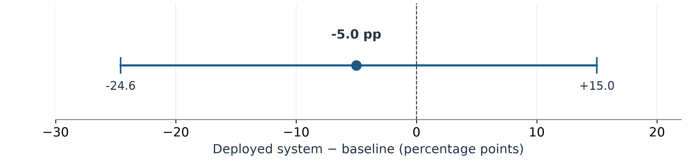

# Hong Kong Movie RAG
## Evidence-Grounded Question Answering and a Paired Diagnostic Evaluation

**COMP4136 Mini-Project | Technical report | 5 October 2026**

Author: ____________________  Student ID: ____________________  Group: __________

## Abstract

This project implements and evaluates a Chinese-language assistant for Hong Kong cinema. A release of 4,659 films supports factual question answering, constrained recommendations, clarification and conversational follow-ups. The deployed system combines domain and entity handling, structured/database retrieval, evidence-restricted generation and validated citations. An initial 30-question diagnostic obtained 28 mechanical passes, but did not test comparative effectiveness. We therefore conducted a harder paired study of 60 selected turns per implementation, comparing the unchanged service with a local BM25 retriever and the same configured Vertex generator. Each arm used its own actual history. Explicit AI review of all 120 outputs/errors found 41/60 completed tasks for the service and 44/60 for the baseline. Dialogue completion favored the service, 18/20 versus 8/20; explicit-ID and compound-constraint tasks exposed weaknesses. Both request failures remain counted. We disclose a citation-adapter defect in an earlier run and the separately frozen correction; the reused questions are not an unseen holdout. The results support a limited conversational benefit, not overall superiority or a causal retriever claim. The contribution is a working, inspectable domain system and an outcome-aware evaluation that explains its successes and failures.

## 1. Introduction and research questions

Film assistants need more than plausible prose. An unqualified title can identify two releases, a recommendation can contain correctly cited films that violate a genre intersection, and a follow-up can replace only one of several constraints. These cases make evidence identity and task completion separate requirements.

The project owner developed the system and engineering for this course. Its practical aim is to help users explore a structured Hong Kong film collection while making factual provenance visible. It does not train a new foundation model or claim a new retrieval algorithm. Its research question is whether the implemented routing and context controls provide observable value relative to a simple retrieval-generation implementation.

- **RQ1:** Which selected factual, ambiguity, boundary and recommendation tasks can each implementation complete?
- **RQ2:** Does the implemented system handle two-turn condition changes and references better than the simple baseline?
- **RQ3:** What do actual answers and retrieved evidence reveal about failure mechanisms?

The study is diagnostic. A truthful result need not favor the proposed system. Subsequent sections describe the literature, native implementation, data, fixed protocol, real observations and limits. Names and identifiers remain blank at the owner's request; this is not a claim of completed course submission.

<!-- pagebreak -->

## 2. Background survey and project positioning

### 2.1 Sparse relevance ranking

BM25 ranks lexical matches using term-frequency saturation and document-length normalization [1]. It is an interpretable reference for a film collection with explicit titles, people and dates. Lexical overlap does not execute a conjunction, identify the latest conversational condition, or ensure that three eligible records reach the reader. To accommodate Chinese segmentation and script variation, the baseline uses generic normalization and character tokens rather than whitespace tokenization.

### 2.2 Dense retrieval and retrieval-augmented generation

Dense Passage Retrieval learns question and passage encoders to select evidence by representation similarity [2]. Relevance selection differs from satisfying precise year/person/genre conditions. This project uses an embedding service and pgvector rather than retraining DPR, and does not claim that DPR's benchmark gains transfer to this catalog.

Lewis et al. combine generation with retrieved non-parametric evidence in fine-tuned RAG models [3], motivating external knowledge and provenance. Here, RAG denotes a deployed pipeline with deterministic paths and a hosted generator, not a reproduction of their trained architecture. A cited metadata record supports its stored fields; it does not by itself justify a plot interpretation or filtering decision.

### 2.3 Evaluation beyond a favorable example

BEIR evaluates retrieval across heterogeneous tasks and reports that BM25 remains a robust baseline [4]. Its broader lesson for this project is that a more elaborate retrieval system needs comparison and task-specific evidence; complexity is not a performance guarantee. This study is much smaller than BEIR and does not use its datasets, ranking metrics or generalization setting. It evaluates completed film-assistant tasks, including clarification and refusal, rather than ranking relevance alone.

### 2.4 Recent research directions

Self-RAG (ICLR 2024) trains adaptive retrieval and critique through reflection tokens rather than always trusting a fixed set of passages [5]. A survey revised in April 2026 organizes agentic RAG around reflection, planning, tool use and different control structures, while identifying evaluation, coordination, memory, efficiency and governance challenges [6]. These are current research directions, not a universal best-system ranking. Our deterministic routing is neither trained Self-RAG nor an autonomous agentic planner, and this metadata study does not benchmark those methods. Their relevance is to motivate future retrieval/reader verification; adding agentic complexity without new evidence would not explain or repair the measured parser failures.

### 2.5 Justified engineering contribution

The implementation supplies release-bound evidence, duplicate-title resolution, person-role and recommendation parsing, bounded conversational anchors, and agreement between citations and movie cards. The baseline retains generic normalization and an evidence-only prompt while omitting specialized routing and structured filtering.

The evaluation examines outcomes and intermediate evidence because gates can over-refuse valid questions and parsers can mishandle natural ranges. It does not assume superiority or isolate one component's causal effect.

<!-- pagebreak -->

## 3. Native system and implementation

### 3.1 Data and serving architecture

The native application source is preserved from the owner's source repository at commit `7b1b87002a0b0bc3548fc365a46095c00ea683da` [7]. A FastAPI service serves the browser UI and a JSON chat endpoint. PostgreSQL/pgvector holds the release-bound metadata, passages and embeddings; Vertex clients provide embedding and generation. Policies and manifests bind the release, model/dimension, relevance settings and serving identity.


*Figure 1.* The two implementations share the frozen metadata universe and selected questions. Each keeps its own actual history. The production release also contains PDF passages, shown separately because they are available but not evaluated here. Gold labels are consumed only by evaluation, never by retrieval or generation.

### 3.2 Query processing and output guarantees

The orchestration validates the question/history, resolves explicit film context and handles unresolved title ambiguity. Domain handling can reject non-film requests before model generation. Recommendation/history planning interprets person roles, year/genre conditions, transitions and exclusions. The repository supplies structured recommendation or vector evidence; canonical metadata facts may be rendered directly, while other supported paths invoke restricted generation.

The service retrieves at most eight unique passages in its general answer path. It validates evidence/citation identities, restricts exact targets and derives movie cards from selected evidence rather than unrelated neighbors. These checks improve traceability; they do not prove that a parsed condition matches the user's intention.

| Native module | Responsibility |
|---|---|
| `demo_api.py` | Request validation, UI/API and nonsecret configuration |
| `rag_query.py` | Answer orchestration, canonical facts and grounding |
| `retrieval.py` | Recommendation, entity/person and context constraints |
| `rag_db.py` | Release-scoped PostgreSQL/pgvector access |
| `vertex_clients.py` | Hosted embedding/generation clients |

History stores actual questions, answers and returned IDs, bounded to four exchanges and 12,000 characters. Failed requests supply no fabricated answer. The harness checkpoint is `6365c9f`; evaluation/report preparation left native code, deployment and resources unchanged.

<!-- pagebreak -->

## 4. Data and baseline methodology

### 4.1 Fixed film release

The evaluation catalog contains 4,659 movie metadata records. Release configuration reports 51 S-tier, 313 A-tier and 4,295 B-tier films. Structured fields include unique movie ID, Chinese/English title, release date, director, cast, genre and production information. The catalog preserves source-description strings referring to Hong Kong Film Archive and IMDb, but this study does not independently verify their collection provenance or every film fact. The reference is agreement with the frozen release fields, not absolute real-world correctness.

There is one deterministic metadata passage per film. The live release additionally exposes five documents with 21 PDF passages and 4,680 embeddings in total. Boundary questions concern films without those five deep documents. All returned citations in both course studies were metadata. Original PDFs, vector exports and posters were unnecessary evaluation inputs; the service was not changed to remove them.

Preprocessing for evaluation builds gold facts and feasible recommendation sets from metadata. A valid recommendation may return any three distinct films satisfying all conditions; matching a particular ranking is unnecessary. Person/director eligibility permits explicit co-credit and aliases stored in the fields. The dataset builder checks full-catalog feasibility before inference. Gold fields and eligible-ID lists are not sent to either arm.

### 4.2 Simple BM25 implementation

The baseline serializes each metadata record as one uniformly weighted JSON document. NFKC and OpenCC `s2hk` normalization handle generic script differences. Chinese runs yield character unigrams and adjacent bigrams; Latin/digit runs yield tokens. It uses unique query terms, `k1 = 1.5`, `b = 0.75`, and the highest eight positive-scoring records, breaking ties by movie ID.


*Figure 2.* Here `f(t,d)` is document term frequency, `df(t)` document frequency, `N` record count and `Lavg` mean token length. The non-negative IDF variant and unique query-term convention are implemented explicitly; this is not a claim of identical behavior to a standard search engine.

### 4.3 Reader and conversation input

Retrieval uses the current question plus that arm's recent question strings and actual movie IDs. The generator additionally receives the arm's bounded history and only the retrieved records as factual evidence. A competent evidence-only prompt asks for identity clarification, latest-condition handling, grounded citations, non-repetition and honest refusal when evidence is insufficient. It requests JSON answer, citation IDs and ordered movie IDs.

The reader uses Vertex/global, configured `gemini-3.5-flash-lite`, 1,024 output tokens, default temperature and one SDK attempt. Output validation rejects unknown/unretrieved IDs, duplicate identities and unmarked citations. The main comparison is between complete implementations: prompts, deterministic paths, internal retries and available PDF evidence differ. It is not a controlled BM25-versus-vector ablation.

<!-- pagebreak -->

## 5. Experimental protocol and integrity

### 5.1 Studies and task set

The original 4 October diagnostic used 30 selected single-turn questions: ten facts, ten recommendations and ten domain/evidence boundaries. All 30 requests returned HTTP 200; 28 passed the original automatic proxy. Two title clarifications did not exercise their intended tasks. Its questions, raw scores and responses remain unchanged; it has no baseline and is not pooled with the challenge.

The harder challenge contains 60 author-selected turns per implementation:

| Family | Turns | Intended behavior |
|---|---:|---|
| Ambiguity / explicit ID | 10 | Clarify five duplicate titles; answer five specified versions |
| Script variants | 10 | Five distinct Traditional/Simplified question pairs |
| Compound recommendations | 10 | Three distinct films satisfying every condition |
| Evidence/domain boundaries | 10 | Appropriate refusal without unsupported facts |
| Dialogue | 20 | Ten two-turn sessions: updates, references, exclusions and domain switch |

Both turns of a conversation count. Some first questions overlap across sessions or resemble the original diagnostic. Forty declared clusters group dialogue pairs, script pairs and paired ambiguity tasks; remaining questions are separate clusters. This does not eliminate all repeated-question dependence.

### 5.2 Dispatch and scoring

Cases, catalog, source bytes, prompt, model and release/policy identities were frozen before each run. Arm order alternates by turn. Each arm uses its own real history, without cross-arm answer copying. There are no manual per-case retries; three consecutive call failures would stop an arm. That guard was not triggered. End-of-run checks found the release configuration and frozen inputs unchanged.

Mechanical scoring checks fact/target/citation identity, recommendation count and conjunctions, exclusions, and intended clarification/refusal. A disclaimer followed by unsupported content fails; so does a correct citation attached to an ineligible recommendation. Root AI read every output/error and recorded an explicit verdict. Original automatic scores are preserved alongside all seven overrides. The judgments are AI review, not human annotation.

### 5.3 Preserved protocol failures

An initial package-name lookup failed before freeze/benchmark dispatch; it made zero formal calls. The first completed run then exposed a baseline adapter defect: bare film IDs in `citation_ids` were rejected despite valid marked answers and retrieved identities. This also erased useful first-turn history. Its 120 records and mechanical totals, 43/60 versus 29/60, are preserved but cannot support method superiority.

The correction only adds the canonical prefix to an ID already supplied as evidence. Answer text, questions, gold, BM25 parameters, prompt, model and scoring did not change. The separately frozen run2 retains parent hashes. Because the same questions were seen during diagnosis, the corrected comparison is explicitly not an unseen holdout. No runs are pooled or unfavorable cases removed.

<!-- pagebreak -->

## 6. Quantitative results

The corrected study ran on **5 October 2026, 18:40:00–18:43:23 HKT**. Both arms attempted 60 requests and returned 59 complete answer payloads. The service's B08 `RemoteDisconnected` and the baseline's M09.1 `ClientError` are retained. The saved exception class does not establish the latter's cause.


*Figure 3.* Bars start at zero; labels give completed/attempted turns. The dialogue denominator is 20, other family denominators are 10. Results describe these selected tasks and include failures. No subgroup intervals were estimated.

| Reviewed outcome | Deployed system | BM25 + LLM |
|---|---:|---:|
| Correct fact/recommendation completion | 27 | 28 |
| Reasonable clarification | 5 | 5 |
| Reasonable refusal | 9 | 11 |
| Task/semantic/filter error | 18 | 15 |
| Request failure | 1 | 1 |
| **Successful task outcome** | **41/60 (68.3%)** | **44/60 (73.3%)** |

Mechanical totals were 42/60 and 38/60. AI review corrected four baseline ambiguity clarifications missed by phrase matching (A1a/A2a/A3a/A5a), two legitimate no-data refusals (B06/B07), and one service refusal with an incorrect explanation (B09). The net change is −1 for the service and +6 for the baseline, yielding the reviewed totals above.

The paired outcomes are 30 both-pass, 11 service-only, 14 baseline-only and five both-fail. Thus the service-minus-baseline difference is **−5.0 percentage points**. Dialogue favors the service, 18/20 versus 8/20; other groups do not justify an overall advantage. A safe partial recommendation remains a failed task when three eligible films exist in the full catalog but fewer are returned.

<!-- pagebreak -->

## 7. Application case study: context and evidence

### 7.1 A successful constraint update

In session M02, the user first requests three 1980s John Woo action films, then asks **“改成1990年代，其他條件不變，推薦3部。”**: change to the 1990s, keep other conditions, and recommend three. The deployed system retains the director/action constraints and returns `1990_DXJT_001`, `1992_LSST_001` and `1991_ZHSH_001` for **《喋血街頭》《辣手神探》《縱橫四海》**. Their release metadata satisfy the updated decade and director conditions.

The baseline's top eight contain only one eligible film for this follow-up, so it returns one. This is a coverage failure rather than invented film facts. The case shows an observable conversational benefit of the complete deployed implementation. It does not prove whether the benefit comes from structured selection, routing, prompt differences or their interaction.

### 7.2 An ordinal reference must use actual output order

M06.2 asks for the director of the second film just recommended. The two implementations returned different first-turn orders: the service's second film is **《醉拳》**, whereas the baseline's is **《警察故事續集》**. Their respective director answers, Yuen Woo-ping and Jackie Chan, both match metadata. Evaluation resolves the reference separately for each arm; copying the service's target into the baseline gold would unfairly mark a correct response wrong.

### 7.3 Clarification and refusal are task outcomes

An unqualified **《英雄本色》** corresponds to 1973 and 1986 records. Asking for year or ID is reasonable, while arbitrarily choosing one version is not. However, once A1b explicitly specifies the 1986 ID, refusing for insufficient fields is a failure: the director field is present. Likewise, lack of box-office/rating fields justifies refusal, but the explanation should match the request rather than misclassify it as a person-list query.

### 7.4 A failure can propagate without a memory mistake

The baseline M09.1 request failed with `ClientError`; M09.2 therefore has no actual previous answer or movie anchor. Asking for clarification on that missing context is safe, but the session task is still incomplete. This dependent failure remains in the overall denominator. It is not evidence of an additional, independent memory-reasoning failure, nor proof that the exception was an authentication problem.

Together these cases show why counting plausible answers alone is inadequate. Outcome-aware evaluation must inspect the requested action, evidence eligibility, actual history and failure dependencies. Exact returned wording and identities remain inspectable in the public 120-record projection [7].

<!-- pagebreak -->

## 8. Failure analysis and intermediate diagnostics

### 8.1 Native gates over-refuse valid facts

All five explicit-ID director questions fail in the deployed arm despite the relevant field existing. The two Police Story language variants also fail with a natural “please query” lead-in. Offline calls to the unchanged `_canonical_metadata_intents` reproduce the distinction: a simple title/director request resolves to `director`, while adding “電影 ID …” yields no canonical intent; “請查詢 … 上映年份” similarly yields none. This is consistent with residual-expression handling in the authority gate. It is a source-level reproduction, not a production request trace, and should not be presented as direct proof of every runtime step.

### 8.2 Ranges and intersections need semantic correctness

C01 requests John Woo action films from **1980–1999**; the full catalog has 11 eligible films. The service explicitly renders **1980–1980** and says there are fewer than three. The unchanged `_year_constraints` reproduces this first-year collapse for the Chinese range expression. Similar behavior appears in other director/year tasks. The data are not missing; the supported range is parsed too narrowly.

C03 asks for action **and** comedy. The service includes **《武館》**, whose catalog genre is action/drama, without comedy. The title, citation and card fields remain correct, yet the selection violates the conjunction. The baseline honestly returns only two eligible retrieved films; it also fails the three-film task, for a different reason.

### 8.3 Baseline reader and context failures

C08 retrieves six eligible Stephen Chow director/co-director comedy films in its top eight, but returns only two and claims only two are available. This underuses already retrieved co-credit/alias evidence; it is not solely a recall problem. M02.1 similarly retrieves four eligible records and uses only two.

In M05, the baseline treats **《無間道II》《無間道III終極無間》** as same-title versions of **《無間道》**, although their full titles differ. The false ambiguity propagates into the follow-up. The native service also retains gaps: M04.2 cannot resolve a director switch to Johnnie To, and M07.2 misinterprets a no-repeat continuation.

| Observed issue | Evidence-based next step, not performed here |
|---|---|
| ID/natural-expression over-refusal | Test residual parsing without weakening exact identity gates |
| Chinese range collapse | Add boundary/range parsing regressions |
| Genre AND mismatch | Validate selected records against the complete conjunction |
| Too few eligible BM25 records | Study condition-aware candidate coverage separately |
| Ignored co-credit/alias evidence | Check reader use of already supplied fields |

These are repair hypotheses grounded in outputs and offline diagnostics. Production code and the frozen results were not changed to improve the reported scores.

<!-- pagebreak -->

## 9. Interpretation, uncertainty and limitations



*Figure 4.* Service-minus-baseline completion difference: −5.0 percentage points. The displayed bounds, −24.6 to +15.0 points, are the 2.5/97.5 percentile bounds from 10,000 resamples of the 40 declared clusters (seed 4136). They describe this selected sample; they do not prove population superiority, equivalence or an independent holdout result.

The difference is calculated from paired pass/fail outcomes, not from unrelated aggregate intervals. Each bootstrap draw resamples whole declared clusters and retains their turns; its denominator can vary because clusters differ in size. Some repeated initial questions lie across clusters, so residual dependence remains. No family-specific confidence intervals or significance claims are invented.

The service's dialogue advantage is a concrete observation on ten two-turn sessions. It does not establish long-history robustness, human satisfaction or a causal benefit of an individual module. Similarly, the baseline's higher point total does not prove that BM25 is universally superior. Routing, prompts, evidence availability, retries and deterministic paths differ.

The cases are author-selected metadata diagnostics, not random population samples. Gold uses the same frozen collection that supplies inference evidence; factual agreement does not independently verify the collection's truth or completeness. Refusal expectations are authored, and audits are AI judgments. A fresh AI review checked all outputs and recorded calculations without finding an important discrepancy, but that remains distinct from independent human evaluation.

The corrected run reused questions seen during protocol diagnosis. Cases were not tuned against answers, and the correction did not change ranking/prompt/scoring, but the run cannot be labeled unseen. The original 30-case result and both 120-call versions remain separate.

PDF reasoning, visual poster quality, concurrency, adversarial inputs, multi-model sensitivity, repeated stochastic trials and longer conversations were not tested. The absence of observed unsupported metadata fields in selected outputs cannot establish zero hallucination for arbitrary users. Before stronger claims, a future study should use new cases, independent human spot checks and a controlled component comparison after clearly versioned repairs.

<!-- pagebreak -->

## 10. Operational observations and reproducibility

### 10.1 Timing, usage and citation integrity

Across all 60 attempts per arm, including failures, median observed request time is **0.733 s** for the service and **1.367 s** for the baseline; maxima are **3.741 s** and **51.125 s**. These serial, mixed-task observations include network and local/cloud processing. Deterministic service paths and different retries mean they are not a model-speed benchmark, throughput estimate or stable SLO.

The baseline's 59 successful provider records report 107,411 input, 9,113 output and 116,524 total tokens. Failed-request potential usage is unknown. The production API does not expose provider usage, so no token or financial cost comparison is made. Sixty API attempts must not be described as sixty production LLM generations.

The service returns 69 citations across 39 cited answers; the baseline returns 95 across 50. All are metadata. A check of 912 returned title/director/cast/genre/date/tier fields found agreement with the catalog. Valid identity and card fields do not guarantee correct filters or explanations.

### 10.2 Inspectable artifacts

| Artifact | Purpose |
|---|---|
| `challenge_cases.jsonl` | Exact frozen 60-turn questions/gold |
| `challenge_eval.py` | BM25, separate histories, dispatch and mechanical checks |
| `challenge_answers.jsonl` | Safe projection of all 120 actual outputs/errors |
| `challenge_review.json` | Explicit Root AI verdict for every record |
| `challenge_summary.json` | Reviewed/mechanical totals, paired statistics and diagnostics |
| `report/build_report.py` | Rebuilds figures/PDF from published evidence and text |

Complete raw provider/operating receipts, freeze snapshots, preserved parent run, source-level diagnostics and the full catalog remain local; public projections are not mislabeled as raw receipts. SHA-256 identities and the exact source checkpoints appear in Appendix A.

The focused evaluation suite passed **33 offline tests**. A delivery verifier reproduced mechanical/AI aggregates, paired statistics, generated cases and exact public projections; it verified parent and original-study hashes. A fresh reviewer also reproduced all 59 saved BM25 rankings and the 912 field comparisons. Full external-data integration is not claimed. The report figures use the actual reviewed summary, not illustrative or placeholder values.

Runtime was Python 3.13.15, google-genai 1.75.0 and OpenCC 1.4.1. Public model names are frozen observed configuration; only baseline successful records expose provider model-version evidence. Rerunning stochastic generation would create a new study, not identical answers.

<!-- pagebreak -->

## 11. Conclusion and author contributions

This project delivers a working Hong Kong movie assistant and a diagnostic evaluation of evidence-grounded task completion. The corrected paired study finds a useful dialogue advantage, 18/20 versus 8/20, but a lower overall reviewed total, 41/60 versus 44/60. Explicit-ID over-refusal, year-range collapse and intersection errors explain why engineering sophistication does not ensure broader success. Baseline failures include insufficient eligible retrieval and underuse of available evidence. These results answer the stated questions within the selected tasks without asserting general superiority.

The main lesson is to evaluate intent, identity, constraints, evidence and conversational dependencies together. Correct citation identities are necessary for traceability but insufficient for satisfying a user's request. The next engineering work should preserve this evidence, version the repairs and evaluate them on additional cases.

### 11.1 Contribution disclosure

The project owner confirms that the native application and engineering were developed for COMP4136, not submitted as another course's assignment. The contribution includes the release/data foundation, API/UI, query/recommendation and history handling, evidence contracts and cloud deployment. This disclosure records the owner's statement; it is not an independent authorship audit.

AI assistance supported course cases/gold tooling, the baseline/evaluator, offline analysis and audit, figures, documentation and this report. AI review is identified as such and is not credited as a human group member. The actual student name, ID and group number remain blank by request. Human audits and registration/submission are pending. No presentation was produced in this report-only delivery.

## References

[1] S. Robertson and H. Zaragoza, “The Probabilistic Relevance Framework: BM25 and Beyond,” *Foundations and Trends in Information Retrieval*, vol. 3, no. 4, pp. 333–389, 2009, doi: 10.1561/1500000019. [Author manuscript](https://www.staff.city.ac.uk/~sbrp622/papers/foundations_bm25_review.pdf).

[2] V. Karpukhin et al., “Dense Passage Retrieval for Open-Domain Question Answering,” in *Proceedings of EMNLP*, 2020, pp. 6769–6781, doi: 10.18653/v1/2020.emnlp-main.550. [ACL Anthology](https://aclanthology.org/2020.emnlp-main.550/).

[3] P. Lewis et al., “Retrieval-Augmented Generation for Knowledge-Intensive NLP Tasks,” *Advances in Neural Information Processing Systems*, 2020, arXiv:2005.11401. [Paper](https://arxiv.org/abs/2005.11401).

[4] N. Thakur, N. Reimers, A. Rücklé, A. Srivastava, and I. Gurevych, “BEIR: A Heterogenous Benchmark for Zero-shot Evaluation of Information Retrieval Models,” 2021, arXiv:2104.08663. [Paper](https://arxiv.org/abs/2104.08663).

[5] A. Asai, Z. Wu, Y. Wang, A. Sil, and H. Hajishirzi, “Self-RAG: Learning to Retrieve, Generate, and Critique through Self-Reflection,” in *Proceedings of ICLR*, 2024. [Conference paper](https://proceedings.iclr.cc/paper_files/paper/2024/file/25f7be9694d7b32d5cc670927b8091e1-Paper-Conference.pdf).

[6] A. Singh, A. Ehtesham, S. Kumar, T. T. Khoei, and A. V. Vasilakos, “Agentic Retrieval-Augmented Generation: A Survey on Agentic RAG,” arXiv:2501.09136v4, revised Apr. 1, 2026. [Survey](https://arxiv.org/abs/2501.09136v4).

[7] Project owner, “COMP4136 Hong Kong Movie RAG: source and evaluation artifacts,” GitHub repository, evaluation snapshot `f405285`, 2026. [Published artifacts](https://github.com/jimmy00415/COMP4136_Project/tree/f4052852e802db88762fb97aff0e7dab97c7ceb7). Accessed: Oct. 5, 2026.

[8] “COMP4136 Mini-Project,” supplied course handout, 2026, pp. 1–5. The report structure follows its background, implementation, experiments, application, contribution and reference requirements.

<!-- pagebreak -->

## Appendix A. Evidence identities and inspection

The following byte hashes identify the original artifacts. They are not interchangeable with Git object hashes, reformatted JSON or stochastic reruns. Runtime source bytes can depend on checkout line endings; the frozen runner/cases and exported evidence preserve their recorded bytes.

| Object | SHA-256 |
|---|---|
| External metadata catalog | `1dbea26150a816ae4fc4d189a2a08e39628cbee997f3966b0dd5cd16843e907b` |
| Challenge cases | `2ab256dc99112b6864f9c41f51f77d216ebff8aeccfa6458c30107f54787e7f5` |
| Corrected runner bytes | `9c41b7abeb9a945d339f362ec8296e8aa02d3219f3a3ab32b6fa311ef0473d34` |
| Corrected raw responses, local | `ab7edac1319e7281e4f8cabcaec927a8367039e4ba5da6d4abde2abfb3ac10fe` |
| Explicit Root AI audit | `85b94e4715b2135300b912825be136fadfde6825940f4d12b91c0d3df6c136e0` |
| Public answer projection | `095b5c18f7a8d918601c0093cb30528b6d3d2ba9ecd4a942a5d6defa8ab71968` |
| Earlier defective raw run, local | `0b14ca2bcceeee4f5db023f19599229a4c156fbbb995fc747b8e92a816a3183b` |
| Original 30-case responses, local | `4918ae3e066ccc8be654bb80c2369f43f5ab0ebae58e72b26c97ae6e52e6d5a8` |

### A.1 Reproduce offline checks

```shell
uv sync --frozen --python 3.13
uv run pytest -q course/test_simple_eval.py
uv run pytest -q course/test_challenge_eval.py
uv run pytest -q course/test_review_challenge.py
```

The application requires external PostgreSQL/pgvector, populated data and matching cloud/policy settings. Offline course tests require none of those inputs and make no live model calls. `report/BUILD.md` describes the separate PDF/plot dependencies; the report does not alter the locked application's dependencies.

### A.2 Evaluated release identity

Release: `v1.2-demo-r3`. Serving revision: `hk-movie-rag-demo-00000-ui-7b1b870`. Embedding configuration: `gemini-embedding-2`, 768 dimensions. Generator configuration: `gemini-3.5-flash-lite`. The report discusses the state recorded by the experiments, not a promise that a public endpoint will remain unchanged.

### A.3 Remaining delivery conditions

This report is the report-only technical artifact requested by the owner. A later course package still requires truthful member/group information, the presentation and the prescribed course-platform actions [8]. `human_audits` remains `pending` and `submission_ready` remains `false`; this report does not represent a submission receipt or grade guarantee.
